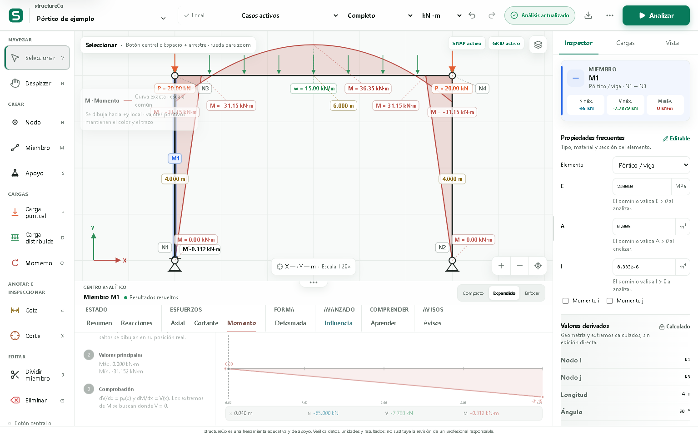

# structureCo

Aplicación web local-first para modelar, analizar y aprender estructuras planas
2D. Integra un editor gráfico, un motor matricial independiente de la interfaz y
resultados trazables desde el modelo hasta las matrices, reacciones y diagramas.

Versión estable: **0.8.0**, cierre del rediseño UX/UI canvas-first.
Rediseño visual integral 2026-08: dirección "Mesa Modular + Laboratorio
Nocturno + Instrumento de Precisión" con claridad inspirada en principios
Apple e identidad propia de ingeniería estructural (ver
[docs/design-system/](docs/design-system/PALETTE.md)).



## Dos experiencias de cálculo

### Aula · diagramas

Pensada para ejercicios de estática y análisis estructural. El estudiante solo
necesita definir:

- nodos y geometría;
- miembros de pórtico o armadura;
- apoyos y liberaciones;
- cargas y el caso o combinación que desea estudiar.

La aplicación conserva internamente propiedades automáticas y entrega reacciones
y diagramas `N`, `V` y `M` sin pedir material, temperatura ni parámetros
avanzados. En estructuras isostáticas, los esfuerzos se determinan por equilibrio
y no dependen de esas rigideces. En estructuras hiperestáticas, el reparto de
esfuerzos sí depende de las propiedades automáticas; el modo Aula lo advierte y
no debe interpretarse como una selección física de material o sección.

### Completo

Expone propiedades de material y sección, teoría Euler–Bernoulli o Timoshenko,
conexiones semirrígidas, asentamientos, temperatura, deformación inicial y forma
deformada. Ambos modos utilizan el mismo solucionador: cambiar de experiencia
modifica los controles visibles, no crea un segundo motor con resultados
incompatibles.

## Capacidades principales

- Marcos y vigas 2D Euler–Bernoulli o Timoshenko; armaduras 2D.
- Miembros inclinados, zonas rígidas colineales y vínculos rígidos exactos.
- Apoyos articulados, rodillos orientables, empotramientos, restricciones
  personalizadas y resortes.
- Liberaciones rotacionales y conexiones semirrígidas mediante resortes de
  extremo y condensación estática.
- Cargas nodales, puntuales y distribuidas uniformes, lineales o parciales;
  momentos puntuales, peso propio, casos y combinaciones lineales.
- Asentamientos o desplazamientos prescritos dependientes del caso de carga.
- Temperatura uniforme, gradiente térmico, deformación axial inicial y curvatura
  inicial.
- Reacciones, desplazamientos y diagramas `N(x)`, `V(x)` y `M(x)` polinómicos
  exactos por tramo.
- Resumen global con máximos y mínimos exactos, localización en el modelo,
  comparación de escenarios y exportación CSV/impresión.
- Deformaciones `u(x)`, `v(x)` y `θ(x)` integradas por tramo, con puntos críticos
  interiores y comprobación de compatibilidad.
- Envolventes mínima y máxima de `N`, `V` y `M`, con identificación del caso o
  combinación gobernante e intersecciones internas entre escenarios.
- Líneas de influencia `N`, `V` y `M` sobre cadenas de miembros frame, con
  límites laterales, extremos interiores y certificación contra análisis de
  carga unitaria independientes.
- Trenes móviles de ejes concentrados con factor de impacto y posición crítica
  analítica, sin barrido por una malla de posiciones.
- Explorador educativo del método de rigidez con grados de libertad, matrices de
  elemento, transformación, ensamblaje, restricciones, residuos y cota numérica.
- Unidades internas kN–m y presentación en kN–m, N–mm, kgf–m o kip–ft.
- Guardado local con respaldo y recuperación, historial, JSON, SVG, PNG e
  impresión.
- Centro de importación con vista previa, selección de contenido, confirmación
  de reemplazo y soporte para JSON, PDF inteligente y paquetes `.structureco`.
- Memoria PDF reimportable con DCL global, diagramas vectoriales `N–V–M`,
  resultados, procedimiento, matrices y un snapshot exacto protegido con
  checksum SHA-256.
- Paquete `.structureco` con `manifest`, proyecto, análisis y memoria PDF; en
  iPhone/iPad usa la hoja nativa de compartir cuando está disponible.
- Interacción unificada para mouse, pantalla táctil y stylus; interfaz responsive,
  tema claro/oscuro y español/inglés.
- Flujo Aula guiado con plantillas parametrizables, predicción previa de
  resultados y revelado progresivo para ejercicios de clase.
- Snapping CAD a cuadrícula, nodos, puntos medios, intersecciones y
  perpendiculares; selección ventana/cruce y filtros por tipo de objeto.

## Ejecutar

```bash
npm ci
npm run dev
```

Vite mostrará la dirección local disponible, normalmente
`http://localhost:5173`.

## Verificar

```bash
npm run verify
npm run qa
npm run qa:webkit
```

`verify` ejecuta lint, la frontera matemática protegida, pruebas automatizadas y
build. `qa` recorre la interfaz en Chromium para escritorio y móvil. `qa:webkit`
valida el centro de importación, la lectura de PDF nativo y objetivos táctiles
≥44px con perfiles iPhone/iPad en WebKit (emulación de dispositivo real, no solo
redimensionar la ventana). Ambos se ejecutan localmente y en verde; ver
[docs/releases/0.8.1/CI.md](docs/releases/0.8.1/CI.md) para el detalle y para
los workflows de GitHub Actions preparados (aún no conectados).

Los scripts `qa:phase2` … `qa:phase14` son checkpoints históricos del rediseño
0.8.0; no forman parte del gate de 0.8.1.

Estado real de la suite (2 de agosto de 2026, programa de endurecimiento 0.8.1):
**530 pruebas en 78 archivos**, todas en verde. Ver
[docs/releases/0.8.1/STATUS.md](docs/releases/0.8.1/STATUS.md) para el detalle
por slice y [docs/releases/0.8.1/PERFORMANCE.md](docs/releases/0.8.1/PERFORMANCE.md)
para presupuestos de rendimiento medidos, no estimados.

## Publicar en Netlify

```bash
npm ci
npm run verify
npx netlify deploy --build
npx netlify deploy --prod --build
```

La configuración reproducible de compilación, publicación, caché y rutas SPA
vive en `netlify.toml`. Siempre se verifica un deploy preview antes de promover
a producción. El vínculo local con el sitio no se versiona.

## Documentación

- [Especificación matemática](docs/MATHEMATICAL_SPEC.md)
- [Especificación de paridad con FTOOL 4.01](docs/FTOOL_PARITY_SPEC.md)
- [Informe de verificación](docs/VERIFICATION_REPORT.md)
- [Auditoría integral](docs/AUDIT_2026-07-12.md)
- [Limitaciones](docs/LIMITATIONS.md)
- [Roadmap](docs/ROADMAP.md)
- [Expedientes PDF y `.structureco`](docs/PORTABLE_EXPEDIENTS.md)
- [Release notes 0.8.0](docs/ux-redesign/RELEASE_NOTES_0.8.0.md)
- [QA del candidato](docs/ux-redesign/RELEASE_QA_REPORT.md)
- [Sistema de diseño · Paleta](docs/design-system/PALETTE.md)
- [Sistema de diseño · Tipografía](docs/design-system/TYPOGRAPHY.md)
- [Sistema de diseño · Espaciado y densidad](docs/design-system/SPACING_DENSITY.md)
- [Sistema de diseño · Motion](docs/design-system/MOTION.md)
- [Sistema de diseño · Iconografía](docs/design-system/ICONOGRAPHY.md)
- [Arquitectura frontend](docs/architecture/FRONTEND.md)
- [Tokens históricos 0.8.0](docs/ux-redesign/DESIGN_TOKENS.md)
- [Biblioteca de componentes (histórico 0.8.0)](docs/ux-redesign/COMPONENTS.md)
- [Contribuir](CONTRIBUTING.md)

### Programa de endurecimiento 0.8.1 (local, sin publicar)

- [Estado por slice](docs/releases/0.8.1/STATUS.md)
- [Modo de trabajo local](docs/releases/0.8.1/LOCAL_MODE.md)
- [Auditoría de dirección visual](docs/releases/0.8.1/DESIGN_AUDIT.md)
- [Política de verificación numérica del motor](docs/releases/0.8.1/VERIFICATION_POLICY.md)
- [Rendimiento medido y presupuestos](docs/releases/0.8.1/PERFORMANCE.md)
- [CI preparado localmente](docs/releases/0.8.1/CI.md)

## Arquitectura

```text
src/
  design-system/       tokens, iconografía estructural, biblioteca sc-* y laboratorio
    tokens.css         paleta Día/Noche, tipografía, spacing, motion
    icons/             glifos estructurales propios (24px · 1.8 · redondeado)
    components/        controles, overlays, feedback, disclosure, foco modal
    lab/               ComponentLab y TopBarLab (solo desarrollo, /__components)
  features/            superficies de producto
    welcome/           pantalla de inicio y nuevo ejercicio
    workspace/         shell del espacio de trabajo y layout responsive
    topbar/            barra superior, estado de análisis y marca
    canvas/            StructuralCanvas, herramientas, capas y overlays
    inspector/         propiedades, cargas y vista
    results/           panel de resultados, resumen y línea de influencia
    classroom/         guía y predicciones del modo Aula
    import-export/     centro de importación y expedientes portables
  data/                proyectos y migración de esquema
  engine/              ★ frontera matemática protegida
    solver.ts          rigidez, restricciones, solución y recuperación
    diagram.ts         funciones internas y deformadas exactas por tramo
    envelope.ts        envolventes analíticas y escenarios gobernantes
    resultSummary.ts   extremos globales y envolventes de resultados
    math.ts            álgebra lineal densa
    units.ts           conversión de unidades
  workers/             ★ análisis y escenarios fuera del hilo de interfaz
  education/           plantillas y progreso del modo Aula
  store/               ★ estado, historial y guardado local
  i18n/                catálogos ES/EN
  utils/               importación y exportación
```

Las áreas marcadas con ★ forman la frontera matemática protegida: el rediseño
visual 2026-08 no modificó su lógica (ver `CONTRIBUTING.md`).

## Alcance y aviso

El motor es estático lineal-elástico, de primer orden y pequeñas deformaciones.
No incluye P–Delta, grandes desplazamientos, plasticidad, cables o elementos solo
a tensión, dinámica, trenes móviles con carga distribuida ni diseño normativo.
Las líneas de influencia y los trenes actuales aceptan una trayectoria abierta de
miembros frame y ejes concentrados; todavía no generan una envolvente móvil para
todos los cortes a la vez. El solucionador actual usa matrices densas.

structureCo es una herramienta educativa y de apoyo. Verifica datos, hipótesis,
unidades y resultados con cálculos independientes antes de emplearlos en una
decisión real; no sustituye la revisión de un profesional responsable.

## Licencia

MIT.
