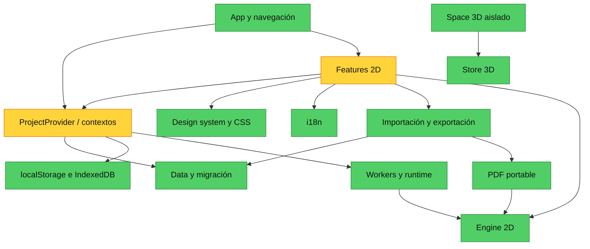

# Auditoría CRI-19 / CRI-21: arquitectura y mutaciones de `ProjectModel`

**Clasificación:** `AUDIT/TEMPORARY`
**Fecha:** 2026-08-12
**Agente:** Codex
**Rama auditada:** `main`
**SHA auditado:** `8e91deda17c9ce2a498d3296cde2a23589b473b7`
**Verificación de remoto:** `origin/main` resolvió al mismo SHA durante la auditoría.
**Versión declarada:** `package.json` `0.8.2`

## Alcance, autoridad y límites

Esta es una revisión diagnóstica. No se refactorizó ni se modificó ningún archivo de producto, test, configuración, esquema, persistencia, motor, unidades, signos, tolerancias, ni contrato protegido. El único cambio de esta tarea es este reporte.

La autoridad aplicada fue: código, pruebas y gates ejecutables; después documentación `CANONICAL`; por último documentación de referencia. Se leyeron `AGENTS.md`, `README.md`, `docs/README.md`, `docs/architecture/README.md` y `reports/README.md`. En particular, `docs/architecture/README.md` declara como fronteras protegidas `src/engine/**`, `src/workers/**`, `src/data/**`, `src/store/ProjectContext.tsx` y `src/types.ts`.

El árbol ya contenía, antes de crear este reporte, dos directorios no rastreados ajenos: `validation/topbar-repeat-after/` y `validation/topbar-repeat-before/`. Se preservaron sin leerlos como evidencia de esta auditoría ni modificarlos. Antes de escribir, `git diff --name-only` no mostró cambios rastreados. Hashes de referencia capturados: `package.json` SHA-256 `DAB8ACB58753872F26ED85E4894B216BB3AE522F5F0C0BB47DA36133C580D7EE`; `scripts/protected-baseline.sha256` SHA-256 `6A07F8FC542746558B7FE8555B2B02F872B8AE1F9ED03ADD89AEE8D0F4BC973F`.

## Mapa de dependencias observado



El grafo se refiere a módulos, no a tamaño de archivos. No se encontraron ciclos de importación con la inspección dirigida. `ProjectProvider` es una raíz de composición legítima: conecta modelo, historial, persistencia, análisis y UI. Su concentración requiere control de contratos, pero no prueba por sí misma una necesidad de partirlo.

## Auditoría 1 — matriz de hotspots de arquitectura

| Área | Evidencia concreta | Responsabilidad y frontera actual | Diagnóstico y cobertura | Veredicto |
|---|---|---|---|---|
| `StructuralCanvas` | `src/features/canvas/StructuralCanvas.tsx:580-609` elimina selecciones; `:611-666` crea nodo/miembro; `:792-932` coloca miembros, apoyos y cargas; `:1196-1261` coordina drag transaccional. Importa capas `CanvasGeometryLayer`, `CanvasResultLayer`, `CanvasInteractionLayer`, minimapa y lupa en `:43-60`. | Orquesta puntero/teclado, cámara, selección, snap, previsualización, geometría y entrada de edición. Las capas de dibujo ya están separadas, pero las decisiones de mutación del modelo siguen en el orquestador visual. | La mezcla no se infiere del tamaño: las mismas funciones resuelven gestos y deciden rutas `updateProject`/`ProjectCommand`. Las pruebas de utilidades de interacción existen, pero no hay una prueba de componente listada para el árbol completo de `StructuralCanvas`; el comportamiento de comandos/transacción se caracteriza en `ProjectContext.test.tsx`. | **Warning — frontera UI/dominio por precisar.** No extraer por tamaño. Priorizar una política de mutación explícita para operaciones estructurales antes de cualquier partición visual. |
| `ResultsPanel` | `src/features/results/ResultsPanel.tsx:104-559` compone modos, accesibilidad y tabs; `:624-859` contiene vistas de diagramas/deformada; `:913-1060` educación e incidencias. Lee `engine/diagram`, `engine/envelope`, `engine/reliability` y `engine/useScenarioAnalysis` en `:4-9`; no llama APIs de mutación de modelo. | Proyección de resultados, navegación de selección y pedagogía sobre `AnalysisResult`; no recalcula el solver ni escribe `ProjectModel`. | `ResultsPanel.test.tsx` cubre tabs, accesibilidad, Aula, modos móviles, trazabilidad y que una configuración puramente presentacional conserva el sobre resuelto (`:234`). La coexistencia de resultados y educación es una decisión de superficie con subcomponentes locales, no evidencia suficiente de duplicación de dominio. | **Mantener estable.** No hay justificación actual para refactor arquitectónico; cualquier extracción debe preservar los resultados y el canvas real. |
| `Inspector` | `src/features/inspector/Inspector.tsx:232-287` crea/edita casos y combinaciones con `updateProject`; `InspectorProperties.tsx:191-290` mezcla actualizaciones directas de nodo/cargas/efectos con comandos de miembro en `:239-266`. | UI de propiedades, unidades de presentación y validación visible; delega conversión a `engine/units` y validación a resultados del dominio, sin reimplementar fórmulas. | La misma superficie contiene ediciones de invariantes estructurales y preferencias de vista. `Inspector.test.tsx:530-604` distingue foco/borrador de mutación, cambios de unidades sin historial y commit exacto con undo/redo: hay buena caracterización de entrada, no una uniformidad de política de escritura. | **Warning — rutas híbridas conscientes pero no documentadas como política.** No convertir el Inspector entero en capa de dominio. |
| `ProjectContext` y los tres contextos | `src/store/ProjectModelContext.tsx:6-27`, `ProjectAnalysisContext.tsx:10-39` y `WorkspaceUIContext.tsx:8-29` separan modelo, análisis y estado efímero. `ProjectContext.tsx:346-483` concentra todas las transiciones del modelo; `:84-167` concentra persistencia; `:180-275` orquesta análisis/worker/fallback. | Es composición y propietario efectivo de snapshots, persistencia, cancelación de análisis, worker y selección posterior a análisis. La división de contextos reduce renders cruzados, pero el proveedor sigue siendo la única bisagra de varios límites. | `ProjectContext.test.tsx` caracteriza comando, edición directa en `StrictMode`, transacción, cancelación, invalidez de resultados y reparación de topología. El hallazgo concreto está en `updateProjectView` (`:384-390`): no invalida análisis, pero `TopBar.tsx:381-399,469-477,558-569` lo usa también para `analysisMode` y `pDeltaConfig`, no sólo para presentación. | **Warning — clasificación semántica inconsistente.** Un resultado ya calculado puede permanecer publicado al cambiar orden de análisis o sus tolerancias/configuración; no afirmar lo mismo para unidades, grid o idioma. |
| CSS / design system | Entrada: `src/styles.css:1-2` importa tokens y fuentes; `App.tsx:10` carga `material.css`; `WorkspaceShell.tsx:15` carga `components/ui.css`. `tokens.test.ts:71-384` protege tokens, temas, elevación y límites de dependencia. | El sistema tiene tokens y componentes semánticos; `styles.css` contiene capas históricas y reglas de superficie, mientras `ui.css` carga después para componentes. | Hay un fallo actual de contrato: `src/design-system/tokens.test.ts:378-382` espera cierta receta Clay para `.repeat-preview button`, mientras la regla vigente de `StructuralCanvas` usa `border:0` y `background:var(--sc-color-surface-2)`. Esto es desalineación test/CSS, no evidencia de que la receta CSS sea errónea. | **Warning — gate focal rojo.** Resolver la discrepancia con decisión visual explícita y prueba actualizada o CSS, sin crear un segundo sistema de tokens. |
| i18n | `src/i18n/catalogs.ts:1,1445-1449,2893-2902` mantiene catálogo tipado `es/en`; `useI18n.ts:1-15` toma idioma del proyecto; `usePhase2I18n.ts:1-14` recibe idioma para no acoplarse al contexto. | Traducción tipada con interpolación central; la variante Phase 2 evita importación de `ProjectContext`. | `catalogs.test.ts:5-39` verifica igualdad estructural, claves, placeholders y que la interpolación no evalúa entrada. El historial registra 43 cambios en `catalogs.ts`, pero frecuencia no es duplicación. | **Mantener estable.** No dividir ni reescribir por tamaño; sólo añadir pruebas por cada nueva familia de copias o si se observa divergencia funcional. |
| PDF / importación-exportación | `utils/calculationPdf.ts:13-90` ensambla secciones; `utils/pdf/reportContext.ts:72-91` crea un índice de modelo y contexto de reporte; `utils/portableFile.ts:85-123` inspecciona/restaura; `portableImportAdapter.ts:213-249` adapta inspección a UI. | PDF recibe `ProjectModel` y `AnalysisResult`, compone contenido y payload portable; importación valida/normaliza antes de entregar un resultado. No se observó una escritura directa desde PDF al modelo activo. | `portable.test.ts:24-115` cubre payload firmado, PDF reimportable, PDFs externos y bundle; el diálogo de importación mantiene etapas inspect/confirm/result (`ImportCenterDialog.tsx:280-338`). | **Mantener frontera.** La separación `reportContext`/formato/ensamblado es una abstracción justificada por el contrato portable. |
| Engine / workers | `engine/solver.ts:440,757,823,1239`; `engine/pDelta.ts:13,22,45,387,560`; `workers/analysis.worker.ts:1-7`. `ProjectContext.tsx:180-275` es la frontera worker/fallback. | El motor consume el modelo, produce resultados y los workers encapsulan el protocolo. El único cambio de modelo asociado al análisis está fuera del solver: reparación de topología en el provider. | Hay validación y pruebas cercanas al motor; esta auditoría no reinterpretó matemática. `ProjectContext.test.tsx:117-146` caracteriza que la reparación es un paso undoable. | **Mantener sin cambios.** No mover lógica de UI al solver ni modificar unidades, signos, tolerancias, protocolos o resultados durante una fase de refactor de mutaciones. |

### Complejidad necesaria frente a accidental

- **Necesaria y con evidencia:** separación de los tres contextos; worker con fallback; patches con precondición para comandos; transacción temporal para arrastre; normalización en fronteras de almacenamiento/importación; PDF portable separado del renderer SVG.
- **Accidental o con señal concreta:** el nombre/semántica de `updateProjectView` admite parámetros que cambian el análisis; la política de cuáles ediciones estructurales usan `ProjectCommand` no está expresada en una frontera única; el contrato CSS de Repeat está desalineado con su prueba.
- **No demostrado:** que `ResultsPanel`, `Inspector`, `StructuralCanvas`, el catálogo i18n o `styles.css` deban partirse por su extensión. No se califican como deuda sólo por tamaño o por cantidad de cambios.

## Auditoría 2 — matriz completa de mutaciones de `ProjectModel`

La matriz enumera rutas de producción detectadas que escriben el modelo activo, sus fronteras de entrada y sus efectos. Operaciones de pruebas no se cuentan como rutas de producción. “Persistencia” describe el efecto observado del `useEffect` de `ProjectContext.tsx:132-167`: 250 ms después de un cambio, rota backup compatible y encadena guardado IndexedDB con revisión esperada, salvo mientras una transacción esté activa.

| Operación / entradas actuales | Mecanismo actual | Undo / redo | Atomicidad | Preview / cancelación | Invalidación de análisis | Persistencia | Riesgo concreto | ¿Candidata a `ProjectCommand`? Motivo |
|---|---|---|---|---|---|---|---|---|
| Carga inicial y migración | `ProjectProvider` inicializa con `loadProjectFromStorage` (`ProjectContext.tsx:35-37`); `projectStorage.ts:19-52` parsea con `normalizeProject`, recupera backup o crea blanco. | No: es frontera de arranque. | Parse/normalización antes de publicar el estado; no es una edición incremental. | No hay preview; una carga inválida preserva el primario bruto en recovery y prueba backup. | No hay resultado previo que invalidar. | El efecto posterior guarda la representación normalizada; IndexedDB migra en `ProjectContext.tsx:84-112`. | Cambiar esta ruta toca schema, migración y recuperación. | **No.** Es una traducción de formato, no una intención de usuario reversible. |
| `renameProject` | `ProjectContext.tsx:338-344`; llamado por `TopBar.tsx:175-184`. Copia superficial y publica nombre. | No añade historial. | Un único reemplazo de objeto. | Borrador local en TopBar hasta `commitProjectName`; no hay cancelación posterior. | No; sólo nombre. | Sí, por efecto normal. | La ausencia de undo parece deliberada para metadato de nombre; no hay evidencia de fallo. | **No.** No cambia geometría, cargas ni resultados. |
| `updateProject` directo | `ProjectContext.tsx:346-369`: clona, ejecuta updater, compara JSON, guarda snapshot, limpia futuro e invalida. Llamadas: `StructuralCanvas.tsx:582,613,660,795-926`; `Inspector.tsx:248-284`; `InspectorProperties.tsx:191,266-290,382-450`. | Sí, snapshot del proyecto anterior, máximo 50; `undo`/`redo` en `:464-485`. | Cada updater es síncrono y se publica completo; no valida con `normalizeProject` en esta ruta. | Formularios numéricos mantienen borradores antes de `onCommit`; fuera de ellos no hay preview/cancel genérico. | Sí. | Sí, tras debounce. | Invariantes y borrados dependientes se implementan en UI distinta; es posible que reglas equivalentes diverjan al añadir una ruta. | **Selectivamente.** No crear un comando genérico para todo; sí evaluar comandos/servicios explícitos para operaciones estructurales que crean o borran dependencias. |
| `executeProjectCommand` | `ProjectContext.tsx:371-382` carga `projectCommand`, compila, aplica patch y valida. Tipos actuales: `member.create`, `member.material.apply`, `member.section.apply`, `member.update`, `member.delete`, `selection.duplicate`, `dxf.import` (`projectCommand.ts:30-48`). Call sites: canvas `:245,607,652`; Inspector `:239,246,257`; DXF `DxfImportDialog.tsx:112`. | Sí, el provider conserva snapshot; `projectCommand.ts:111-121` además construye inverso exacto probado. | Patch aplica precondiciones por entidad y valida frontera; un fallo no publica cambios (`projectCommand.test.ts:98-112`). | Duplicación prepara preview antes de confirmar (`duplicatePreview.ts:17`); DXF se inspecciona antes de confirmar. | Sí. | Sí, tras debounce; DXF crea recovery antes de ejecutar (`DxfImportDialog.tsx:105-114`). | Mantener patch e inverso coherentes; no todas las colecciones están representadas por comandos. | **Ya lo es.** Mantenerlo para cambios con identidad, dependencias o precondiciones explícitas. |
| `updateProjectView` | `ProjectContext.tsx:384-390` clona y publica sin historial ni invalidez. Usos de vista: grid/snap/capas/idioma/unidades en Inspector, TopBar, Welcome y CommandPalette. Usos analíticos: `TopBar.tsx:381-399,469-470,558-569` cambia `analysisMode` y `pDeltaConfig`. | No. | Un único reemplazo de settings. | Controles inmediatos; no preview/cancelación. | **No**, incluso para orden y parámetros P-Delta. | Sí, porque `settings` vive en el proyecto. | Resultado existente puede no corresponder a la modalidad/configuración P-Delta recién elegida. El test de Results sólo justifica conservar resultados ante cambio de presentación, no ante esos campos. | **No para preferencias de vista; sí necesita reclasificación semántica antes de decidir su ruta.** No implica que todo `settings` deba ser comando. |
| `beginProjectTransaction` | `ProjectContext.tsx:392-397`; canvas inicia drag en `StructuralCanvas.tsx:1196`. Conserva clon inicial y descripción. | Prepara un único snapshot, aún no visible en historial. | Atómica respecto del inicio; evita reabrir transacción anidada. | Base para cancelación. | No por sí sola. | El efecto de guardado queda suspendido mientras `transactionActive`. | Sólo sirve si todos los caminos de salida hacen commit/cancel; el canvas contiene dicha coordinación. | **No.** Es semántica de gesto, no una intención de dominio autónoma. |
| `updateProjectTransient` | `ProjectContext.tsx:399-406`; usado por el harness y por lógica de drag a través de la transacción. | No por cada frame; se agrupa al commit. | Publica cada estado temporal clonado. | `cancelProjectTransaction` restaura origen. | Sí, cada estado temporal. | Suspendida por transacción activa. | Si se usara fuera de transacción, mutaría sin historial; el call-site productivo de nodo usa el API especializado. | **No.** Es una optimización/control de interacción necesaria. |
| `moveNodeTransient` | `ProjectContext.tsx:408-420`; canvas lo programa con `requestAnimationFrame` en `StructuralCanvas.tsx:384-404`. Actualiza únicamente nodo y array afectados. | Se agrupa por transacción iniciada antes del drag. | Un reemplazo inmutable de nodo/array; sin validación adicional. | Cancelación de puntero llama `cancelProjectTransaction`; flush antes de commit en `:1259-1262`. | Sí. | Suspendida mientras arrastre; commit fuerza revisión de persistencia. | Es correcto que no sea patch por frame; su seguridad depende del par begin/commit/cancel. | **No.** No convertir movimiento continuo en muchos comandos. |
| `commitProjectTransaction` | `ProjectContext.tsx:422-431`; canvas `:1261`. Si cambió, agrega sólo el snapshot inicial a pasado y limpia futuro. | Sí, una entrada para todo el drag; probado en `ProjectContext.test.tsx:71-93`. | Historial atómico al final del gesto. | Cierra la ventana de cancelación. | Ya fue invalidado durante updates. | Incrementa `persistenceRevision` y habilita el guardado. | El nombre de la entrada proviene de begin; no se observó otro caller productivo. | **No.** Es parte indivisible de transacción UI. |
| `cancelProjectTransaction` | `ProjectContext.tsx:433-443`; canvas `StructuralCanvas.tsx:400-405` ante cancelación de drag. Restaura el snapshot inicial. | No crea undo; deja historial anterior. | Restauración completa del snapshot. | Sí; es la cancelación explícita del gesto. | Sí. | Incrementa revisión para persistir la restauración. | Si una nueva interacción coexistiera con la transacción, restauraría todo el snapshot; el state machine del canvas evita esa coexistencia. | **No.** Necesaria para preview/rollback de gesto. |
| `replaceProject` | `ProjectContext.tsx:445-462` normaliza, guarda proyecto actual como “Abrir proyecto”, reinicia UI y puede restaurar análisis. Invocado por nuevo/ejemplos (`WelcomeScreen.tsx:123-129,366`; `TopBar.tsx:335-340`), importación (`WelcomeScreen.tsx:361`, `TopBar.tsx:535`), hub (`Phase2ProjectHub.tsx:7-10`) y pegado de canvas (`StructuralCanvas.tsx:1318-1321`). | Sí, snapshot total; redo normaliza. | El nuevo modelo se normaliza antes de publicar; no es patch parcial. | Importación tiene etapas y sólo entrega resultado tras confirmación; pegado no tiene preview cancelable. | Sí; si recibe análisis restaurado lo vuelve a publicar para ese import. | Sí, tras debounce; hub conserva revisión esperada de repositorio. | Es una operación muy potente: un input validado reemplaza el agregado entero. `restoredAnalysis` supone que el payload portable corresponde al proyecto validado. | **No como comando genérico.** Reemplazo, importación y apertura son fronteras de documento, no edición entidad a entidad. |
| `undo` / `redo` | `ProjectContext.tsx:464-485`; restauran snapshot, limpian selección; redo normaliza. | Son el mecanismo de historial de rutas anteriores. | Restauración de snapshot completo. | No hay preview; el usuario inicia intención explícita. | Sí. | Sí por cambio de proyecto. | Las entradas de `updateProjectView`/rename no existen en historial por diseño actual. | **No.** Deben permanecer independientes de la implementación de comandos. |
| Reparación topológica al analizar | `ProjectContext.tsx:180-199` clona, llama `repairProjectTopology`, publica si une nodos/divide miembros y agrega “Reparar topología” al historial antes de resolver. | Sí; el caso completo y su undo están probados en `ProjectContext.test.tsx:117-146`. | La reparación completa se publica antes del análisis; el resultado agrega issue informativo. | No hay preview/cancelación de la reparación una vez que el usuario solicita análisis; el resultado es deshacible después. | El análisis se ejecuta sobre el modelo reparado. | Incrementa revisión de persistencia. | `analyze()` tiene efecto de edición, inesperado si sólo se interpreta como consulta; es deliberado y caracterizado, pero debe seguir siendo visible en UX/documentación. | **No por defecto.** Es normalización/reparación dependiente de contexto de análisis, no un comando de UI ordinario. |
| Importación DXF | `DxfImportDialog.tsx:77-114` inspecciona ASCII, permite cancelar al cerrar, crea recovery y construye `dxf.import`; `dxfParser.ts:250-306` entrega nodos/miembros. | Sí, por `executeProjectCommand`. | Patch con precondiciones y validación para los objetos importados; recovery previo ante el flujo de DXF. | Sí: inspección antes de confirmar; errores no llaman al comando. | Sí. | Sí, ruta común; recuperación se guarda antes de la mutación. | Debe preservar conversión de unidad, plantilla de miembro e IDs; no hay permiso para cambiar estos contratos en un refactor visual. | **Ya lo es.** Es buen ejemplo de importación incremental con intención reversible. |
| Importación portable/JSON/PDF/.structureco | `ImportCenterDialog.tsx:280-338` cancela inspección por request id y pasa de confirmación a resultado; `portableImportAdapter.ts:213-249` inspecciona/valida; callbacks de TopBar/Welcome usan `replaceProject` en `:535`/`:361`. | Sí, por snapshot de `replaceProject`; no patch granular. | La inspección/normalización ocurre antes; reemplazo activo es atómico desde la UI. | Sí antes de confirmar. Tras `runImport`, el propio diálogo deshabilita salir mientras está importando (`:233-236,515-521`). | Sí al reemplazar; puede restaurar análisis portable. | Sí. La opción de guardar proyecto actual pasa por exportación antes de reemplazar cuando el usuario lo eligió. | La recuperación del proyecto anterior depende de snapshot/undo y de la decisión de guardado, no de `ProjectCommand`; no se halló prueba focal de undo de una importación portable en el provider. | **No.** Es apertura/reemplazo de documento validado, no patch de entidades. Añadir caracterización de undo/resultado restaurado antes de cualquier cambio. |
| Project Hub y recoveries | `ProjectHub.tsx:51-81` renombra/duplica registros almacenados; `:83-91` restaura recovery y llama `onOpen`; `Phase2ProjectHub.tsx:7-10` convierte sólo el open/restore en `replaceProject`. | Renombrar/duplicar en repositorio no toca el modelo activo; open/restore sí obtiene snapshot vía replace. | Las operaciones de repositorio tienen sus propias escrituras/revisión; el active model cambia sólo en callback de apertura. | Restore selecciona recovery explícitamente; no preview del contenido antes del open en este componente. | Sólo tras `replaceProject`. | Repositorio usa checksum/revisión esperada; tests `projectRepository.test.ts:33-135` cubren copia, conflicto, migración, rename/duplicate. | No confundir una mutación de biblioteca IndexedDB con una mutación del `ProjectModel` activo. | **No.** La entidad persistida es una frontera de repositorio y open es un reemplazo. |

### Inventario de call sites de producción

- **Canvas:** duplicación command (`StructuralCanvas.tsx:245`), borrado de miembro command (`:607`), creación condicional de miembro command (`:652`) y operaciones directas de nodo/miembro/apoyo/cargas/split/borrado/paste (`:582-660,795-932,1318-1321`); drag transaccional (`:384-404,1196,1261`).
- **Inspector:** casos/combinaciones directos (`Inspector.tsx:248-284`), preferencias de display vía `updateProjectView` (`:298`), propiedades, cargas, desplazamientos impuestos y efectos directos (`InspectorProperties.tsx:191,266-290,382-450`), presets/actualización de miembro por comando (`:239-266`).
- **TopBar y palette:** nombre (`TopBar.tsx:184`), nuevo/ejemplos/importación con replace (`:335-340,535`), settings de vista y también análisis/P-Delta (`:369-399,469-477,558-569`), grid/snap (`CommandPalette.tsx:164,171`).
- **Welcome y proyectos:** idioma vía view (`WelcomeScreen.tsx:110`), blanco/ejemplos/ejercicios/importación con replace (`:123-129,361,366`), abrir/restore desde IndexedDB (`Phase2ProjectHub.tsx:7-10`).
- **Importación:** DXF manda command (`DxfImportDialog.tsx:112`); importación portable devuelve outcome validado y el callback del host reemplaza el modelo.
- **Rutas internas de provider:** carga/migración, guardado, repair durante analyze, update directo/command/view/transacción/reemplazo/undo/redo en `ProjectContext.tsx:35-37,132-167,180-199,338-485`.

## Áreas que deben mantenerse sin cambios durante un refactor posterior

1. `src/types.ts`, `src/data/migrate.ts`, `src/data/projectStorage.ts`, `src/storage/projectRepository.ts` y sus formatos/checksums. Son contratos de modelo, schema y recuperación.
2. `src/engine/**`, `src/workers/**`, `src/runtime/workerProtocol.ts`, unidades, signos, tolerancias y resultados. El diagnóstico de mutaciones no autoriza cambios matemáticos ni de protocolo.
3. `src/commands/projectCommand.ts` como contrato de patch, precondición e inverso existente, hasta que una prueba de caracterización cubra cualquier extensión.
4. La topología y el comportamiento de `repairProjectTopology`; su mutación inducida por análisis está caracterizada y debe conservar undo, issue informativo y persistencia.
5. El canvas SVG real, sus transformaciones, snapping, orden de capas y geometría compartida con PDF; no sustituirlo por una capa visual estática para “simplificar”.
6. El payload portable PDF/.structureco, validación SHA-256 y límites de importación. `replaceProject` no es autorización para cambiar formato o política de seguridad.
7. Aislamiento del dominio Space 3D en `src/space3d/**` y `src/features/space3d/**`; no mezclar su store o comandos con `ProjectModel` 2D.

## Ranking de refactors realmente justificados

| Prioridad | Refactor o preparación | Evidencia y beneficio | Riesgo / condición de entrada |
|---|---|---|---|
| 1 | **Caracterizar y separar semánticamente los settings que invalidan análisis.** | `updateProjectView` no invalida (`ProjectContext.tsx:384-390`), pero escribe `analysisMode` y `pDeltaConfig` (`TopBar.tsx:381-399,558-569`). Evita presentar un resultado calculado bajo una configuración distinta. | **Alto riesgo de dominio.** Primero pruebas que distingan preferencias visuales de campos que alteran cálculo; no migrar todos los settings ni formatos. |
| 2 | **Definir la política de mutación por familia de operación, no unificar mecánicamente.** | Canvas e Inspector usan tanto snapshots directos como patches (`StructuralCanvas.tsx:580-666`; `InspectorProperties.tsx:191-290`). Aclara qué cambios requieren invariantes, precondiciones y dependencias. | **Medio/alto.** Mantener directos los gestos transitorios y preferencias; extender comandos sólo cuando una operación concreta tenga contrato reversible y testable. |
| 3 | **Extraer, sólo si las pruebas lo sostienen, operaciones estructurales directas con dependencias.** | Borrado de nodo/multiselección, split y creación de miembro combinan varias colecciones en Canvas (`StructuralCanvas.tsx:582-605,611-666,871-880`). Son las rutas con mayor probabilidad de divergencia de invariantes. | **Alto.** Empezar con pruebas de ida/undo/redo/precondición; no tocar métodos de solver, schema, persistencia ni IDs. |
| 4 | **Hacer explícito que analizar puede reparar el modelo y preservar su caracterización.** | `analyze()` reescribe topología antes de resolver (`ProjectContext.tsx:180-199`), ya probado (`ProjectContext.test.tsx:117-146`). La mejora es de contrato/UX, no de matemática. | **Alto.** No convertirlo automáticamente en `ProjectCommand`; decidir primero si la intención sigue siendo “reparar para analizar”. |
| 5 | **Resolver el contrato CSS de Repeat antes de más trabajo visual.** | La prueba de tokens falla contra la regla vigente: 64 pruebas focales pasan y una falla en `tokens.test.ts:379`. | **Bajo de código, medio visual.** Requiere decisión sobre cuál receta Clay es canónica y verificación visual; no es un refactor de arquitectura. |

No se justifica actualmente: partir `ResultsPanel`, `Inspector`, `StructuralCanvas`, `catalogs.ts` o `styles.css` por tamaño; convertir cada `updateProject` en comando; mover preferencias UI fuera del modelo sin una decisión de persistencia/migración; ni alterar la frontera PDF/engine/Space 3D.

## Recomendaciones concretas para la siguiente fase

1. Abrir una fase de caracterización exclusiva para `updateProjectView`: probar que grid, snap, idioma y unidades conservan análisis cuando corresponde, y que orden/parametrización P-Delta invalidan o bloquean resultados anteriores según el contrato que se apruebe.
2. Publicar una tabla de decisión pequeña junto a `ProjectModelContext`: **command** para cambios discretos con identidad/dependencias/precondiciones; **snapshot directo** para edición local ya caracterizada; **transient transaction** para gesto continuo; **replace** para documentos validados. No implementar esa tabla como nueva capa todavía.
3. Antes de promover cualquier operación de Canvas a comando, crear casos RED de creación con endpoint nuevo, split, borrado en cascada de nodo/multiselección y undo/redo. Si el comportamiento actual requiere reparar topology o conservar orden, detenerse y documentarlo antes de codificar.
4. Añadir pruebas de integración para importación portable: confirmación/cancelación, `replaceProject`, undo al proyecto anterior y validez del `restoredAnalysis`. No cambiar el formato portable durante esa fase.
5. Corregir o actualizar, con revisión visual separada, la única expectativa CSS fallida; no esconderla relajando el gate ni duplicando tokens.
6. Mantener la próxima fase en una superficie de mutaciones y contexto. Excluir solver, workers, schema, persistencia, formatos, unidades, signos, resultados, Space 3D y render geométrico real salvo autorización explícita posterior.

## Evidencia y comandos utilizados

### Inspección de estado y documentación

```powershell
git branch --show-current
git rev-parse HEAD
git ls-remote origin refs/heads/main
git status --porcelain
Get-Content -Raw AGENTS.md
Get-Content -Raw docs/README.md
Get-Content -Raw README.md
Get-Content -Raw docs/architecture/README.md
Get-Content -Raw reports/README.md
```

Resultado relevante: rama `main`, `HEAD` y `origin/main` en `8e91deda17c9ce2a498d3296cde2a23589b473b7`; documentación canónica y fronteras protegidas revisadas.

### Recon de historial y dependencias

```powershell
git rev-list --count HEAD
git log --format=format: --name-only
git log -i -E --grep='fix|bug|broken' --name-only --format=''
git log --format='%an'
git log --format='%ad' --date=format:'%Y-%m'
rg -n '^import ' src/main.tsx src/App.tsx src/store/ProjectContext.tsx ...
rg -n '\b(updateProject|executeProjectCommand|beginProjectTransaction|commitProjectTransaction|cancelProjectTransaction|updateProjectTransient|moveNodeTransient|replaceProject|updateProjectView|renameProject|undo|redo)\s*\(' src
```

El repositorio contiene 246 commits entre 2026-07-17 y 2026-08-12. Hotspots históricos: `src/styles.css` (80), `src/i18n/catalogs.ts` (43), `src/features/canvas/StructuralCanvas.tsx` (16); entre los asociados a commits “fix/bug/broken” aparecen `styles.css` (29), `ResultsPanel.tsx` (4) y `engine/pDelta.ts` (4). Estos conteos sólo se usaron para priorizar lectura; no son hallazgos por sí mismos.

### Pruebas focales ejecutadas

```powershell
npx.cmd vitest run src/store/ProjectContext.test.tsx src/commands/projectCommand.test.ts src/data/projectStorage.test.ts src/storage/projectRepository.test.ts src/features/import-export/ImportCenterDialog.test.tsx src/i18n/catalogs.test.ts src/design-system/tokens.test.ts src/design-system/components/dependencyBoundary.test.ts --maxWorkers=1
```

Resultado: **7 archivos / 64 pruebas pasaron; 1 archivo / 1 prueba falló**. La única falla fue `src/design-system/tokens.test.ts` “keeps Repeat cancellation visually separated with existing Clay control material”, porque la expectativa de `.repeat-preview button` no coincide con la regla CSS presente. No se ejecutó build ni el gate completo, por lo que no se certifica el repositorio completo ni se extrapola este resultado a matemáticas, PDF o Space 3D.

## Pendiente

- Revisión humana de la prioridad y del contrato deseado para settings analíticos frente a preferencias de vista.
- Decisión visual para la discrepancia CSS de Repeat antes de declararla resuelta.
- No hay refactor, commit ni push autorizados o realizados por esta auditoría.
