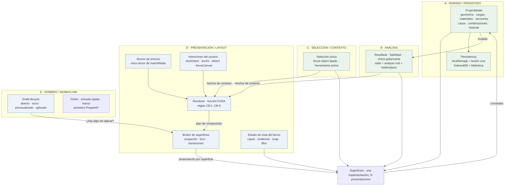

# CRI-9 — Arquitectura de interacción adaptativa de StructureCo

**Fecha:** 2026-08-15 04:00
**Agente:** Claude Code
**Rama:** `research/cri-9-adaptive-interaction-architecture`, partiendo de `origin/main` en **`07f80b9`** (`07f80b99a3ae9cb4404c5882d4195a814f331dd9`, «merge: CRI-8 — mapa maestro de funciones, superficies y tareas»)
**Clasificación:** `AUDIT/TEMPORARY` — investigación de una fecha concreta. No es especificación, no es contrato de producto y no prueba implementación.

> **Qué es y qué no es.** CRI-7 respondió *dónde duele*. CRI-8 respondió *qué existe y de qué contexto depende*. CRI-9 responde **cómo se organiza técnicamente la interacción y qué composición aloja cada tarea**. No fija estética (eso es CRI-10), no construye prototipos (CRI-11) y **no toca una sola línea de producción**. Su salida es el contrato arquitectónico que CRI-10 debe consumir sin volver a decidir arquitectura.

**El Brandbook Clay oficial se leyó íntegro** (`brand/brandbook-clay.html`, 14 secciones) antes de emitir cualquier juicio. Es la autoridad normativa de UX visual e identidad. Cuando el código actual lo contradice, se registra como desviación a reconciliar, nunca como fuente alternativa.

---

## 0. Resumen ejecutivo

Se eligió una arquitectura que llamaremos **Alternativa D — resolutor puro + broker de superficies**, combinación deliberada de la A (shell único con slots) y la C (kernel de orquestación), con la lógica compartida que pedía la B pero **sin sus compositores por clase**.

Su idea central es una sola frase:

> **La clase de espacio deja de ser una etiqueta de ancho y pasa a ser la salida de una regla de presupuesto de lienzo.**

Nadie escribe «1024». Una función pura calcula, para cada viewport, la composición más rica que todavía respeta el presupuesto del lienzo. Eso hace estructuralmente imposible repetir F-01 —tres reglas contradictorias sobre la misma variable— porque ya no hay una variable que contradecir.

El modelo geométrico que implementa esa regla está **calibrado contra las mediciones reales de CRI-7 con un error máximo de 0.24 puntos porcentuales** sobre once viewports. Sus predicciones:

| Viewport | Hoy | Con la arquitectura elegida |
|---|---|---|
| 1024×768 (portátil corriente) | Expanded · **24.6%** de lienzo | Medium · **81.7%** en reposo, 55.9% con detalle |
| 1280×800 | Expanded · 30.3% | Expanded · **77.4%** en reposo, 55.2% con detalle |
| 1440×900 | Expanded · 36.1% | Expanded · **79.8%** en reposo, 59.8% con detalle |
| 768×1024 (tablet) | Compact · 82.8% | Compact · **88.1%** — lo que ya estaba bien, mejor |
| 844×390 (móvil apaisado) | Compact · 69.5% | Compact · **83.6%**, con la hoja llegando por el lado |

La frontera Expanded↔Medium queda entre **1042 y 1130 px según la altura**, y no está escrita en ninguna parte: se calcula.

**14 decisiones DECIDED, 1 DEFERRED (D-15, Space 3D, por diseño), 0 UNKNOWN.** De los diez unknowns heredados de CRI-8, **siete quedan resueltos con cita de código** (U-03, U-04, U-05, U-06, U-08, U-09, U-10) y tres siguen abiertos por falta de telemetría o de medición (U-01, U-02, U-07). Se declaran cinco unknowns nuevos.

---

## 1. Método, y qué se verificó de verdad

### 1.1 Qué se leyó

- `reports/2026-08-14-2330-cri-7-auditoria-ux-integral.md` y su evidencia, íntegros.
- `reports/2026-08-15-0130-cri-8-mapa-maestro-ux.md` y su inventario de 122 tareas × 33 columnas, íntegros.
- `brand/brandbook-clay.html`, íntegro.
- El enunciado completo de CRI-9 en Linear, incluidas las quince decisiones y los tres hallazgos con disposición.

### 1.2 Qué se inspeccionó en `main` antes de proponer nada

No se citó nada de memoria. Cada afirmación de este informe sobre el producto trae archivo y línea:

| Área | Qué se leyó | Qué se comprobó |
|---|---|---|
| Shell | `WorkspaceShell.tsx` (313 líneas), `AppShellLayout.tsx` (63) | Retorno de foco, `inert`/`aria-hidden`, `visualViewport`, normalización de detents, lazy loading, coordinación de cierre |
| Preferencias | `useWorkspaceLayoutPreferences.ts` | `clamp` 280–480, detents normalizados, persistencia tolerante a fallos |
| Bus | `workspaceCommands.ts` | 12 comandos tipados; `FocusableSelection` hace imposible un foco inválido |
| Estado | `WorkspaceUIContext.tsx`, `ProjectModelContext.tsx`, `ProjectContext.tsx` | Separación de dominio/análisis/UI; API de comandos y borradores |
| Lienzo | `StructuralCanvas.tsx` (2 499 líneas), `CanvasResultLayer.tsx`, `CanvasMiniMap.tsx`, `editorLayers.ts` | Rama táctil, picker de solapados, lupa, long-press, condiciones de dibujo |
| Superficies | `ResultsPanel.tsx`, `DatasheetPanel.tsx`, `ModelDoctor.tsx`, `CommandPalette.tsx`, `TopBar.tsx`, `Inspector.tsx` | Modos, umbrales propios, rutas de escritura |
| Persistencia | `projectRepository.ts`, `ProjectContext.tsx` | Precedencia localStorage ↔ IndexedDB y transacción de conflicto |
| 3D | `App.tsx`, `Space3DWorkspace.tsx` | Qué sobrevive al entrar y salir |
| CSS | Barrido de umbrales sobre `src/**/*.css` | **31 umbrales de ancho distintos** en **96 bloques condicionados por ancho** (de 138 bloques `@media`/`@container` en total); 11 bloques de capacidad de puntero o hover |

### 1.3 Qué NO se hizo

No se modificó `src/**`, ni CSS, ni tokens, ni componentes, ni el solver, ni el esquema. No se implementó ningún fix de CRI-7/8, ni G-01, ni G-02. No hay prototipos ni mockups. No se eligió el verde de marca. No se rediseñó Aula. No se hizo merge ni se publicó en Pages. Los únicos archivos añadidos están bajo `reports/**`.

### 1.4 El límite honesto de la investigación competitiva

El proxy de red de este entorno **bloquea el acceso directo** a los dominios de fabricante: se volvió a comprobar en esta ejecución y `cad.onshape.com` devuelve `EGRESS_BLOCKED`. El contenido se recuperó con la herramienta de búsqueda web, que sí alcanza y resume esas mismas páginas oficiales.

**Cinco de las siete fuentes se re-verificaron de forma independiente en esta ejecución** — precisamente aquellas de las que dependen decisiones concretas: Onshape (D-06), Shapr3D (D-07/D-09), ETABS (D-11), RFEM (D-03) y Fusion (D-03/D-09). RISA y SkyCiv se citan como las dejó CRI-8.

Consecuencia declarada: las citas son fieles al contenido recuperado de páginas oficiales, pero no se han cotejado carácter a carácter contra el HTML original. **Ninguna decisión de este informe depende de un matiz literal de esas fuentes.**

---

## 2. El diagnóstico que ordena todo lo demás

CRI-7 y CRI-8 dejaron el problema descrito. Al leer el código, la causa se ve más precisa de lo que ninguno de los dos llegó a formular:

> **La modalidad de cada superficie se decide hoy en cuatro sitios distintos, con cuatro reglas distintas, y ninguno sabe de los otros.**

| Superficie | Quién decide su presentación | Con qué umbral |
|---|---|---|
| Inspector | `styles.css` + una bandera booleana en `WorkspaceShell` | 1023/1024 en CSS y `matchMedia('(min-width:1024px)')` en JS |
| Results | El propio `ResultsPanel`, con su `matchMedia` | 1023 px, más un `@container` a 560 px |
| Model Doctor | El propio `ModelDoctor`, con su `useCompactDoctor` | **700 px**, decidido en JS |
| Datasheet | Nadie: es siempre un `Drawer` modal | — |
| ToolRail | Sólo CSS | 1023/1024, con tres reglas contradictorias sobre `--toolbar-w` |

Eso no es un layout responsive con un bug. Es **la ausencia de un dueño de la composición**. F-01 no fue un descuido: fue la consecuencia estadísticamente esperable de repartir 31 umbrales de ancho entre 96 bloques sin que nadie tenga autoridad sobre el conjunto — el mismo recuento que publicó CRI-8, verificado de nuevo en este árbol.

Y hay un segundo diagnóstico, menos visible y más caro:

> **Lo que cambia entre Expanded, Medium y Compact no es qué superficies existen ni qué contienen. Es la presentación de cada una, y si puede coexistir con el lienzo.**

Las 122 tareas de CRI-8 no cambian de naturaleza al estrecharse la ventana. Cambia **dónde se alojan**. Cualquier arquitectura que duplique contenido por clase está resolviendo un problema que no existe.

---

## 3. Las cuatro arquitecturas comparadas

Se evaluaron las tres alternativas del enunciado y una cuarta que surgió del diagnóstico anterior.

### Alternativa A — Shell adaptable único con slots

`AppShellLayout` evoluciona: los mismos slots cambian de presencia, posición y modalidad según condicionales.

- **A favor:** coste de migración mínimo; `AppShellLayout` ya declara en su comentario que el dominio queda fuera y sólo compone superficies, que es la frontera correcta. Cero duplicación de markup.
- **En contra, y es decisivo:** no resuelve la causa. Los condicionales responsive siguen repartidos entre el shell, el CSS y cada superficie. Es exactamente la arquitectura que produjo F-01, con más condicionales. La testabilidad no mejora: para afirmar «en 1024×768 el rail se contrae» sigue haciendo falta un navegador.

### Alternativa B — Compositores distintos por clase sobre lógica compartida

Tres compositores (`ExpandedComposer`, `MediumComposer`, `CompactComposer`) que consumen la misma selección, view-models, comandos y análisis.

- **A favor:** cada composición se lee de un vistazo. Muy claro para quien entra nuevo.
- **En contra, y es decisivo:** triplica el markup y las rutas de foco de cada superficie, y con ello el riesgo de divergencia, que es precisamente la restricción protegida («no crear una segunda app»). Peor aún: **rompe las transiciones**. Si Expanded y Compact son árboles distintos, cruzar la frontera desmonta y remonta cada superficie — y con ella su borrador, su desplazamiento y su foco. La matriz de transiciones de §8 sería inimplementable sin serializar y restaurar estado a mano en cada superficie. B compra claridad de lectura al precio de la propiedad que más nos importa.

### Alternativa C — Kernel de orquestación compartido + surface composers

Una capa única decide estado, contexto y transiciones; cada modo compone sólo sus superficies.

- **A favor:** un solo dueño de la composición y de las transiciones. Es la dirección correcta.
- **En contra:** «kernel» describe una responsabilidad, no una frontera. Tal como está enunciada, mezcla en un mismo objeto lo que se puede probar sin DOM (¿qué cabe?) con lo que no (¿dónde va el foco, sobrevive el borrador?). Y sigue teniendo «composers por modo», heredando parte del problema de B.

### Alternativa D — Resolutor puro + broker de superficies · **ELEGIDA**

Parte C, pero con el kernel **partido en dos por testabilidad**, y con la composición de A: un único árbol de slots, sin compositores por clase.

```
┌─────────────────────────────────────────────────────────────────────┐
│ 1 · NÚCLEO DE DOMINIO           ProjectModel · comandos · historial  │  sin cambios
│                                  persistencia · solver 2D           │
├─────────────────────────────────────────────────────────────────────┤
│ 2 · NÚCLEO DE CONTEXTO          Selección · focus-object · análisis  │  sin cambios
│                                  herramienta activa                 │
├─────────────────────────────────────────────────────────────────────┤
│ 3 · SENSOR DE ENTORNO           el ÚNICO módulo que lee matchMedia   │  NUEVO
│                                  espacio · input · safe-area · a11y  │
├─────────────────────────────────────────────────────────────────────┤
│ 4 · RESOLUTOR  (función PURA)   (entorno, intenciones, contexto)     │  NUEVO
│                                        → plan de composición        │  probable sin DOM
├─────────────────────────────────────────────────────────────────────┤
│ 5 · BROKER DE SUPERFICIES       ocupación · transiciones · foco      │  NUEVO
│     (con estado)                 borradores · degradación anunciada  │  formaliza lo que
│                                                                      │  WorkspaceShell ya hace
├─────────────────────────────────────────────────────────────────────┤
│ 6 · SUPERFICIES                 una implementación por superficie,   │  reorganiza las
│     + primitivas de presentación N presentaciones                    │  actuales
└─────────────────────────────────────────────────────────────────────┘
```

La regla que separa la capa 4 de la 5 es la que hace ganar a D:

- **El resolutor responde «¿qué cabe?».** Es una función pura de datos a datos. Se prueba con `vitest` sin navegador, sin DOM, sin Playwright. El modelo de §12 **ya está escrito y ya se ejecuta**: es el archivo `canvas-budget-model.mjs` de la evidencia.
- **El broker responde «¿qué le pasa a lo que había?».** Foco, borradores, pila de retorno, degradación. Necesita DOM, pero su superficie de prueba es pequeña porque no decide nada sobre tamaños.

Hoy, para afirmar «el rail se contrae en Medium», hace falta construir la app y medir en Chromium. Con D es una aserción sobre una función pura. Ese cambio de testabilidad es, por sí solo, el argumento más fuerte: **F-01 vivió en `main` porque ninguna prueba podía afirmar barato qué composición estaba activa.**

### Comparación por los criterios obligatorios

| Criterio | A · Shell adaptable | B · Compositores por clase | C · Kernel + composers | **D · Resolutor + broker** |
|---|---|---|---|---|
| Riesgo de duplicar lógica | Bajo | **Alto** — 3 árboles | Medio | **Bajo** — 1 árbol |
| Riesgo de divergencia entre modos | **Alto** — condicionales dispersos | **Alto** — divergen por construcción | Medio | **Muy bajo** — la presentación es un dato |
| Complejidad de estado/transiciones | Alta e implícita | **Muy alta** — hay que serializar y restaurar | Media | **Media, pero explícita y en un solo sitio** |
| Testabilidad | **Mala** — exige navegador | Mala | Media | **Alta** — el 80% de la decisión es una función pura |
| Accesibilidad y foco | Repartida hoy en 3 refs sin contrato | **Peor** — remontaje pierde foco | Centralizada | **Centralizada con contrato explícito (T-INV-3)** |
| Preservación de borradores | Casual | **Estructuralmente hostil** | Posible | **Garantizada (T-INV-8 + DraftLifecycle)** |
| Mantenibilidad | Se degrada con cada breakpoint | Baja | Media | **Alta** — añadir superficie = añadir fila |
| Lazy loading y performance | Ya funciona | Peor: 3 árboles a dividir | Igual | **Igual o mejor** — la presentación no afecta al chunking |
| Coste de migración | **Mínimo** | Muy alto | Alto | **Medio** — §17 |
| Facilidad para funciones futuras | Media | Baja | Alta | **Alta** |
| Claridad de ownership | **Baja** — es el problema actual | Media | Alta | **Alta y verificable** |
| Compatibilidad con Brandbook/CRI-10 | Neutra | Neutra | Neutra | **Buena** — CRI-10 diseña presentaciones, no clases |
| Capacidad de mantener el lienzo dominante | **No la tiene: es el fallo actual** | Depende de cada compositor | Sí | **Sí, y es su regla constitutiva** |

### Qué se descarta exactamente

- **De A se descarta** que los condicionales responsive puedan seguir repartidos. **Se conserva** su frontera de slots: `AppShellLayout` es la base sobre la que se construye la capa 6, no algo a tirar.
- **De B se descarta** por completo la idea de compositores por clase. Se conserva su premisa —lógica, selección, view-models y comandos compartidos—, que en D es aún más fuerte porque también se comparte el árbol.
- **De C se descarta** el kernel monolítico. Se conserva su idea de un dueño único de la orquestación, partido en dos por testabilidad.

---

## 4. El modelo mental: espacio y capacidad de input, separados

Las tres clases se definen por **capacidad de espacio**, y las afordancias por **capacidad de input**. Son ejes independientes: una tablet de 1024 px es Medium con input táctil; una ventana estrecha de escritorio es Medium con ratón y teclado.

**Regla dura (T-INV-7): el input NUNCA cambia la composición.** Conectar un ratón a una tablet cambia tamaños de objetivo y rutas de gesto, no dónde vive el Inspector. Mezclar los dos ejes es exactamente lo que hace hoy que una tablet de 1024 px se comporte como un portátil.

| Clase | Qué la define | Composición |
|---|---|---|
| **Expanded** (`X2`) | El presupuesto paga **dos docks laterales** | ToolRail 164 px con etiquetas + detalle en dock de 320 px con reflow |
| **Medium** (`M1`) | El presupuesto paga **un dock lateral** | ToolRail 76 px sólo iconos + detalle **superpuesto sin reflow** |
| **Compact** (`K0`) | El presupuesto no paga docks | Dock de herramientas flotante + **una sola capa contextual**, como hoja |

**Medium no es Expanded reducido, y ésa es la respuesta a D-01.** Tiene dos diferencias cualitativas, no de grado:

1. **El detalle no recompone el lienzo.** Restar 300 px de 1024 en cada selección sería un salto del 29% del ancho cada vez que el usuario toca un objeto. En Medium el detalle se superpone al borde y lo que se reduce es el **rectángulo seguro** — el concepto que `canvasChromeGeometry.ts` ya implementa y comparte entre el encuadre y la colocación de rótulos. La cámara no se mueve.
2. **Ninguna superficie de resultados es residente.** Ni en Medium ni, de hecho, en Expanded (§7).

Capacidades de input, que se resuelven aparte:

| Capacidad | Qué gobierna | Qué NO gobierna |
|---|---|---|
| `mouse` / `trackpad` | Hover como previsualización, ciclado con `Alt` | Presencia de nada |
| `keyboard` | Rutas equivalentes a todo, tabulación por objetos del lienzo | Presencia de nada |
| `touch` | Objetivos de 44 px, lupa, picker de precisión, acciones contextuales | Presencia de nada |
| `stylus` | Igual que táctil con radio de captura de puntero fino | Presencia de nada |

---

## 5. Catálogo de superficies

Dieciocho superficies con **un dueño cada una** y presentación declarada en las tres clases. La tabla completa está en `report-tables.md` § TABLA C; aquí, la reorganización que importa.

### 5.1 Lo que se descompone

**El `Inspector` se parte en tres, por dueño.** CRI-8 §5.3 lo dejó demostrado: dos de las tres pestañas del panel de la selección no dependen de la selección.

| Hoy | Va a | Dueño |
|---|---|---|
| Pestaña «Inspector» (propiedades, material, sección, bulk edit) | `detail` | Selección |
| Pestaña «Cargas» (casos y combinaciones) | `analysis-setup` | Proyecto/análisis |
| Pestaña «Vista» (~20 ajustes, filtro de selección, snap) | `view` | Estado de vista del lienzo |

**El `ResultsPanel` se parte en cuatro**, que es la respuesta a D-03:

| Responsabilidad | Va a | Por qué |
|---|---|---|
| Estado del análisis, fiabilidad | `topbar` | Es global persistente y es la afirmación más crítica del producto |
| Elección de evidencia (N/V/M/deformada/mapa) | `view` | **Elegir evidencia es elegir capa**, no abrir una pestaña de resultados |
| Detalle del objeto y **procedencia del número** | `detail` | Se leen junto a las propiedades del mismo objeto |
| Reacciones, influencia, «Entender» | `dense` | Datos densos: invocados, nunca residentes |

### 5.2 Lo que se crea

| Superficie | Qué resuelve |
|---|---|
| `contextual-actions` | La ruta táctil de copiar, pegar, duplicar, repetir, borrar y transformar (D-07). Aparece con la selección y desaparece con ella. Es lo que descarga ToolRail y el cajón «Más». |
| `recovery` | La recuperación de conflicto desde la mesa (D-08). Cierra el hueco de acceso más grave de CRI-8. |
| `view` | Dueño único de la visibilidad del lienzo (D-10). Absorbe capas, presets, `show*`, snap y filtro de selección. |
| `analysis-setup` | El contexto de análisis viaja junto a la acción que gobierna, no fijo en la TopBar (D-09). |

### 5.3 Lo que se conserva intacto

`canvas`, `toolrail`, `dense` (datasheet), `doctor`, `palette`, `status`, `welcome`, `classroom`, `space3d`. **La TopBar sobrevive**, reducida de siete naturalezas a tres: identidad del documento, acción global y estado.

Y se conservan explícitamente las 28 fortalezas de CRI-8 §16. Las que la arquitectura toca de cerca y **no puede perder**:

- una sola selección compartida por cinco superficies;
- `focus-object` con carga tipada;
- el datasheet como proyección, no modelo paralelo;
- la disciplina táctil bajo `(pointer:coarse)`, con área de acierto separada del trazo dibujado;
- `Escape` como cancelación total de siete estados;
- la lupa que clona el render real con `<use>`;
- el picker con lista **y** ciclado con contador;
- el canvas-budget de Compact y su arquitectura de hojas;
- las preferencias de layout ya construidas y persistidas;
- el registro único de herramientas que alimenta rail, dock, hoja y paleta;
- `prepareTopologyRepair` enumerando lo que omite y lo que no resuelve;
- que no se ampute ninguna función en Compact.

---

## 6. Mapa de ownership



**Verde = sin cambios de ownership.** El dominio, el análisis y la selección se quedan exactamente donde están y como están. Toda la novedad vive en presentación y en workflow efímero, que es donde debe vivir.

**Las flechas que NO existen son la parte importante:**

- No hay flecha de la capa D a la A. **Cambiar de viewport no puede tocar el ProjectModel.**
- No hay flecha del broker al `DraftLifecycle`. El broker **pregunta** si hay borrador sucio; no lo aplica ni lo cancela.
- No hay flecha de las superficies al resolutor. Una superficie no puede pedir su propia presentación.

La matriz completa de las cinco categorías, con quién escribe cada estado y qué le pasa en una transición, está en `report-tables.md` § TABLA D. Dos entradas merecen destacarse porque resuelven unknowns:

**`stale` es fail-closed por construcción (U-06 resuelto).** La obsolescencia no es una bandera sobre un resultado vivo: `invalidateAnalysis` pone el análisis a `null`, y `stale` se deriva de `analysis === null && hadAnalysis`. Como todos los overlays exigen `analysis?.success`, **es imposible pintar evidencia caducada sobre el modelo**. Esa propiedad hay que protegerla explícitamente en cualquier rediseño: es gratis hoy y sería cara de recuperar.

**Los `settings.show*` son estado de presentación dentro del modelo persistido.** Abrir el proyecto de otra persona cambia tus preferencias de vista. Lo corrige D-10.

---

## 7. Matriz Expanded / Medium / Compact × input

Versión completa por superficie en `report-tables.md` § TABLA C, y por tarea —las 122— en § TABLA G y en `cri-9-task-placement.csv`.

| Superficie | Expanded | Medium | Compact | Qué cambia por input |
|---|---|---|---|---|
| `canvas` | Protagonista, con reflow | Protagonista, **sin reflow** | Protagonista | Lupa + picker en táctil; hover-preview en puntero; tabulación por objetos en teclado |
| `topbar` | Banda | Banda | Banda comprimida | Nada. Ningún control depende de hover |
| `toolrail` | Dock 164 px | **Dock 76 px iconos** | Dock flotante | 44 px en táctil; 11 teclas en teclado |
| `contextual-actions` | Inset con selección | Inset con selección | Inset con selección | **Es la ruta táctil** de MOD-09/10/12/13 |
| `detail` | Dock, **contextual** | **Inset, contextual** | Hoja con detents | Detents sólo en táctil; contenido idéntico |
| `analysis-setup` | Inset invocado | Inset invocado | Hoja invocada | Nada |
| `view` | Inset invocado | Inset invocado | Hoja invocada | Chips accionables en los tres |
| `dense` | Drawer · dock fijable si CB paga | Drawer con `peek` | Fullscreen con `peek` | Pegado de bloque necesita afordancia propia en táctil |
| `doctor` | Drawer lateral | Drawer con `peek` | Hoja/fullscreen con `peek` | Lanzador con recuento en las tres clases |
| `palette` | Overlay modal | Overlay modal | Hoja casi completa | `Ctrl/⌘+K` en teclado; entrada propia en táctil |
| `preferences` / `output` / `recovery` | Drawer invocado | Drawer invocado | Hoja invocada | Nada |
| `transient` / `status` | Overlay | Overlay | Overlay con safe-area | El picker cambia a su variante de dedo |

**Las 122 tareas de CRI-8 se ubican sin ambigüedad**: 42 por una regla determinista de diez entradas sobre su clase UX primaria, y 80 por excepciones declaradas — cada excepción **es** una decisión de CRI-9 y cita cuál. El generador falla con código 1 si alguna queda sin superficie.

---

## 8. Matriz de transiciones

La regla que ordena las diez transiciones cabe en una línea:

> **Cambiar de viewport es un evento de presentación. No toca el dominio, no toca la selección, y no compromete ni descarta un borrador.**

### Los ocho invariantes

| ID | Regla |
|---|---|
| **T-INV-1** | Un cambio de clase nunca muta `ProjectModel`, nunca hace commit ni cancel de un borrador, y nunca cambia la selección. |
| **T-INV-2** | Una superficie no se **cierra** en una transición: **migra** de presentación. Cerrar exige un acto explícito o un conflicto irresoluble, y entonces se anuncia. |
| **T-INV-3** | El foco sigue a su superficie. Si migra, va al elemento equivalente; si no puede mostrarse, vuelve al invocador y se anuncia. |
| **T-INV-4** | **El teclado virtual no es un cambio de clase.** `visualViewport` ajusta safe-rect, detents y desplazamiento; jamás vuelve a resolver la composición. |
| **T-INV-5** | El resolutor tiene **histéresis** en las fronteras y sólo commitea sobre tamaño estable. Un arrastre continuo de split-screen no puede producir una cascada de recomposiciones. |
| **T-INV-6** | La rotación conserva el desplazamiento **por ancla** (la fila, el hallazgo, el objeto enfocado), nunca por offset en píxeles. |
| **T-INV-7** | Un cambio de input cambia afordancias de inmediato y **nunca** la composición. |
| **T-INV-8** | Un borrador sin aplicar **bloquea la sustitución** de su superficie: si el destino es exclusivo, el origen se **suspende con su estado**, no se destruye. |

T-INV-2 corrige un comportamiento vigente: hoy `WorkspaceShell` cierra el inspector móvil al cruzar 1024 px (`WorkspaceShell.tsx:65-73`). Eso es pérdida de contexto silenciosa, y es justo lo que el enunciado prohíbe.

T-INV-4 es la más importante en la práctica: sin ella, escribir dentro de una hoja recompondría la aplicación bajo el dedo del usuario. El producto ya distingue `visualViewport` de `innerHeight` y ya normaliza detents al abrirse el teclado; el invariante convierte ese acierto en contrato.

### Las diez transiciones

Cada una especifica selección, superficie activa, borrador, foco y retorno de foco, desplazamiento interno, overlays, lienzo y `Escape`. Tabla completa en `report-tables.md` § TABLA E. Las tres que más cosas deciden:

**TR-02 · Medium → Compact.** El detalle pasa de inset a hoja **por el borde que CB-6 permita**, conservando borrador y desplazamiento. Si había dos capas contextuales activas, CB-6 obliga a suspender la de menor prioridad **y a anunciarlo**.

**TR-07 · Teclado virtual.** No hay cambio de clase. La hoja se ajusta al viewport visual y su detent se normaliza si el campo con foco quedaría tapado. Es el caso donde siempre hay borrador, y sobrevive por construcción.

**TR-10 · Mesa 2D → Space 3D.** Aquí hay un **riesgo declarado**, no una solución cómoda: `WorkspaceShell` se desmonta por completo, así que los borradores que viven en su estado local no sobreviven. El dominio 2D sí (`ProjectProvider` está por encima) y las capas también (ya se persisten). Contrato: **antes de navegar a Space 3D, `DraftLifecycle` debe pedir confirmación si hay borradores sucios.**

---

## 9. Contrato de selección precisa

Cinco fases, idénticas en los cuatro inputs. Es la respuesta a D-06.

| Fase | `mouse` / `trackpad` | `touch` | `stylus` | `keyboard` |
|---|---|---|---|---|
| **1 · Detección de candidatos** | `elementsFromPoint` en el punto exacto, filtrado por `selectionFilter` | Igual, con **radio de captura ampliado** — las áreas de acierto ya existen bajo `(pointer:coarse)` | Igual, radio de puntero fino | El lienzo ya es tabulable: los candidatos son las paradas |
| **2 · Previsualización antes de comprometer** | Resaltado por hover | **La lupa**, extendida al tap-y-mantener sobre `select` | Lupa con radio fino | Anillo de foco propio sobre el objeto SVG |
| **3 · Elección y ciclado** | Picker con lista + `Alt`+clic para ciclar, con contador «i de n» | **El mismo picker**, colocado para no tapar el punto que se intenta acertar; arrastrar mueve el objetivo | Igual que táctil | Flechas dentro del picker |
| **4 · Compromiso** | Clic | Levantar el dedo sobre el candidato resaltado | Igual | `Enter` |
| **5 · Cancelación** | `Escape` o clic fuera | Levantar fuera del picker | Igual | `Escape` |

**Las dos decisiones que lo hacen viable:**

1. **La lupa y el picker no son dos mecanismos: son dos fases de uno.** CRI-8 §10.3 lo formuló como una disyuntiva («¿enrutar el picker o extender la lupa?»). Leído el código, no lo es: la lupa *ve* y el picker *elige*, y las dos hacen falta.

2. **No se añade un cuarto gesto táctil.** El lienzo ya distingue tap, long-press, arrastre-pan y pinza. El long-press de 480 ms que hoy selecciona a ciegas pasa a **armar el picker cuando hay más de un candidato**, y se comporta exactamente como hoy cuando hay uno solo. Onshape resuelve el mismo problema con mantener-arrastrar-soltar; se adopta el principio, no la retícula.

**Dos reglas más, que son contrato:**

- **Cancelar nunca altera la selección previa.** Hoy `Escape` limpia siete estados de una vez, lo cual es correcto como cancelación total. Con el picker abierto, `Escape` tiene **alcance acotado**: cierra sólo el picker.
- **La ampliación del objetivo nunca engorda la geometría técnica.** Ya está bien resuelto (`.member-hit { stroke-width:44 }`, `.node-hit { r:22px }`) y es exactamente lo que pide el Brandbook §02: el dibujo se mantiene analítico, lo táctil está alrededor.

---

## 10. Contrato de navegación entre superficies

Un solo contrato para las siete transiciones profundas. La regla que lo resume:

> **Localizar nunca destruye la superficie de origen: la degrada a `peek` y la recuerda.**

Hoy tanto el datasheet (`DatasheetPanel.tsx:359-361`) como el Model Doctor cierran su superficie antes de emitir `focus-object`, porque taparían el objeto centrado. Es una consecuencia honesta de la superficie, no un descuido — y `peek` la resuelve sin acoplar ventanas.

`NavigateToObject(origen, destino, intención)`, en seis pasos:

1. **Selección** — se fija en el destino, con la misma semántica de siempre. El bus `focus-object` ya lleva carga tipada; se le añade **un token de origen opcional**, y eso es lo único nuevo que necesita el bus.
2. **Superficie de origen** — pasa a `peek` (viva y reducida). Si el destino es exclusivo en esa clase, el origen se **suspende con su estado serializado** y aparece una vuelta explícita. Nunca se destruye.
3. **Vuelta** — restaura presentación, ancla de desplazamiento y foco del origen.
4. **Foco del destino** — el objeto del lienzo con su anillo propio, o el encabezado de la superficie de destino.
5. **Borradores** — sobreviven a la suspensión (T-INV-8).
6. **Comando compartido** — `focus-object`, que ya es único y ya tiene cuatro emisores y un consumidor.

| Transición | Origen tras navegar | Foco destino | Vuelta |
|---|---|---|---|
| Hallazgo → objeto | Doctor en `peek` | Objeto en el lienzo | Al hallazgo, con su desplazamiento |
| Resultado → miembro | `dense` en `peek` | Miembro + `detail` con su resultado | A la fila |
| Fila de datasheet → objeto | `dense` en `peek` | Objeto en el lienzo | A la fila |
| Objeto → datasheet | Detalle permanece | Fila del objeto, ya filtrada | Al objeto |
| Selección → editar sección/material | Detalle permanece | Selector de catálogo | Al detalle |
| Fiabilidad → causa | Chip permanece | **Elemento enfocable** con la causa gobernante | Al chip |
| Conflicto → recuperación | Chip permanece | Lista de recuperaciones | A la mesa, sin perder trabajo |

---

## 11. Reglas de panel ↔ inset ↔ hoja ↔ drawer ↔ fullscreen

Vocabulario cerrado. Una superficie sólo puede tener una de estas presentaciones, y quien la elige es el resolutor.

| Presentación | Cuándo | Coexiste con el lienzo | Foco | Escape |
|---|---|---|---|---|
| `band` | Chrome permanente justificado (sólo TopBar) | Sí | No atrapa | No aplica |
| `dock` | El presupuesto paga espacio permanente y el reflow es barato | Sí, con reflow | No atrapa | No cierra |
| `inset` | El presupuesto paga la superficie pero **no** el reflow | Sí, sin reflow | No atrapa | Cierra |
| `sheet` | Compact: la superficie **es** la tarea activa | Parcial, con detents | No atrapa mientras haya lienzo visible | Cierra y devuelve foco |
| `drawer` | Superficie densa invocada sobre el lienzo | No — es modal | **Atrapa**, con `inert`/`aria-hidden` en el fondo | Cierra y devuelve foco |
| `fullscreen` | Sustituye la mesa | No | Atrapa | Vuelve, conservando contexto |
| `overlay` | Efímero ligado a un gesto | Sí | No atrapa | Cancela sólo lo suyo |
| `floating` | Chrome sobre el lienzo | Sí | No atrapa | No aplica |

**Reglas de convivencia:**

- **R-1 · Una capa contextual a la vez en Compact.** La hipótesis del enunciado se adopta, con **una excepción documentada**: el canal de estado (`status`) y las superficies efímeras ligadas a un gesto (`transient`) pueden coexistir con cualquier otra. Un toast que no puede aparecer porque hay una hoja abierta es un aviso perdido; y una entrada rápida que se cancela al abrirse un picker rompe la colocación en curso. Fuera de esas dos, si una segunda capa se solicita, la primera se suspende **y se anuncia**.
- **R-2 · `drawer` y `fullscreen` son exclusivos entre sí** en todas las clases.
- **R-3 · Ninguna superficie puede pedir su propia presentación.** Sólo el resolutor la asigna.
- **R-4 · `peek` es un estado de `drawer`/`fullscreen`, no una presentación nueva**: la superficie sigue viva y montada, reducida a una banda que conserva su desplazamiento y su borrador.
- **R-5 · La modalidad implica gestión de foco.** `drawer` y `fullscreen` atrapan foco y marcan el fondo `inert`; `dock`, `inset` y `sheet` no. Esto ya está bien implementado y se eleva a contrato.

---

## 12. Reglas de canvas-budget

Seis reglas. Todas medibles con el script de auditoría que CRI-7 ya dejó escrito.

| ID | Regla | Qué protege |
|---|---|---|
| **CB-1** | **Suelo de coexistencia: ≥ 50%.** Cuando el lienzo y una superficie *conviven* como contexto de trabajo (`dock`, `inset`), el lienzo conserva al menos la mitad del viewport. | Es la regla que hace imposible el 24.6% de 1024×768 |
| **CB-2** | **Suelo de reposo: ≥ 70%.** Sin ninguna superficie auxiliar invocada. | Es la regla que impide reservar espacio «por si acaso» |
| **CB-3** | **Chrome flotante ≤ 12% del lienzo.** Por encima, se degrada por prioridad declarada: **primero el minimapa**, luego los chips de vista, nunca los controles de cámara ni el estado. | 17.5% en 1024×768 y 14.5% en móvil apaisado hoy |
| **CB-4** | **Ninguna superficie persistente ocupa más área que el lienzo.** | El Inspector con 27.6% frente a un lienzo de 24.6% |
| **CB-5** | **El rectángulo seguro se deriva de chrome medido, nunca de constantes.** | F-07: el minimapa mide 144 px y el encuadre reserva 68 |
| **CB-6** | **En Compact, el detent por defecto deja ≥ 40% del escenario como lienzo vivo**, y la hoja llega por el borde que preserve la dimensión mayor: inferior en retrato, **lateral en apaisado**. | Una hoja inferior en un viewport de 390 px de alto deja el lienzo inservible |

**Dos alcances declarados, porque una regla sin alcance es dogma:**

- **CB-1 no se aplica a una hoja que el usuario levantó explícitamente.** Ahí la superficie *es* la tarea activa y manda CB-6. Exigir 50% de lienzo mientras alguien edita propiedades en un móvil sería un número por encima del sentido.
- **CB-2 gobierna el defecto.** Un pin explícito del usuario puede gastar hasta CB-1; lo que no puede es cruzarlo.

### El modelo, y por qué se le puede creer

`reports/evidence/2026-08-15-cri-9-adaptive-architecture/canvas-budget-model.mjs` implementa estas reglas como función pura. Sus constantes están **despejadas de las mediciones de CRI-7**, no elegidas: la banda de TopBar sale de que 8.9% de 1024×768 son 68.3 px; el rail de que 14.1% son 163.6 px; y así todas.

Al ejecutarlo, lo primero que hace es reproducir la composición **actual** y compararla con las once cifras publicadas por CRI-7. **Error máximo: 0.24 puntos porcentuales.** Si superara 0.5, sale con código 1 y el modelo no debe usarse para decidir nada.

Un detalle de esa calibración vale la pena: para cuadrar los once viewports, el dock de herramientas de Compact tiene que contar como banda fija **sólo en retrato**. Eso no es un ajuste: la columna de chrome flotante de CRI-7 confirma independientemente el otro lado del mismo hecho — en 844×390 el chrome flotante sube al 14.5% del lienzo, el máximo de los once. **Dos columnas independientes coinciden.**

### Lo que el modelo predice

| Viewport | Hoy | Resuelve | Reposo | Con detalle | Lienzo |
|---|---|---|---|---|---|
| 390×844 | Compact 81.0% | `K0` | **87.4%** | 35.0% (hoja) | 390×295 |
| 844×390 | Compact 69.5% | `K0` | **83.6%** | 51.9% | 524×326 · **hoja lateral** |
| 768×1024 | Compact 82.8% | `K0` | **88.1%** | 35.3% | 768×361 |
| 900×1000 | Compact 82.4% | `M1` | **83.3%** | 53.0% | 524×910 |
| **1024×768** | **Expanded 24.6%** | `M1` | **81.7%** | **55.9%** | 648×678 |
| 1112×834 | — | `X2` | 76.1% | 50.4% | 628×744 |
| 1280×800 | Expanded 30.3% | `X2` | **77.4%** | 55.2% | 796×710 |
| 1440×900 | Expanded 36.1% | `X2` | **79.8%** | 59.8% | 956×810 |
| 1920×1080 | — | `X2` | 83.8% | 68.6% | dock denso **fijable** |

Y la frontera, que **nadie escribe**:

| Altura | Expanded desde |
|---|---|
| 768 px | 1117 px |
| 900 px | 1089 px |
| 1080 px | 1065 px |
| 1366 px | 1042 px |

Un umbral que depende de la altura es imposible de expresar con `@media (min-width:1024px)`. Ésa es, en una línea, la razón técnica por la que la clase tiene que calcularse.

### La consecuencia que más sorprende

**Ninguna superficie de resultados es residente en ninguna clase.** No es una preferencia: el presupuesto no la paga. Un dock de datos densos a su altura mínima (190 px) sólo cumple CB-1 por encima de ~1700 px de ancho — y aun entonces, como **pin explícito**, nunca por defecto.

Esto coincide con lo que RFEM documenta (su navegador de resultados aparece tras un cálculo correcto) y con lo que ETABS demuestra (cientos de tablas disponibles, ninguna permanentemente visible), pero no se adopta por imitación: se adopta porque sale de la aritmética.

---

## 13. Registro de decisiones D-01…D-15

Versión completa con evidencia línea a línea en `report-tables.md` § TABLA A y en `cri-9-decision-register.json`.

| ID | Decisión | Status | Resumen |
|---|---|---|---|
| **D-01** | Contrato real de Medium | **DECIDED** | Las clases son la **salida** de las reglas CB, no umbrales de ancho. Medium = `M1`: rail de iconos + detalle **superpuesto sin reflow** + cero resultados residentes. La frontera se calcula (1042–1130 px según altura). |
| **D-02** | Presencia del Inspector | **DECIDED** | Contextual a la selección en las tres clases, **y el Inspector se parte en tres por dueño**. Las rutas de edición individual y múltiple se conservan íntegras: `detail` tiene dos cardinalidades, no dos superficies. |
| **D-03** | Descomposición de Results | **DECIDED** | Deja de existir como panel. Estado y fiabilidad → TopBar; elección de evidencia → `view` (es una capa); detalle y procedencia → `detail`; datos densos → `dense`, invocada. |
| **D-04** | Reparto por defecto | **DECIDED** | El defecto lo calcula el resolutor. Las preferencias pasan a ser **intenciones** que se honran cuando CB lo permite y se **degradan con anuncio** cuando no. Los tres conmutadores solapados colapsan a `dockIntent` por dock + `focusCanvas`. |
| **D-05** | Viewport / contenedor / input / contexto | **DECIDED** | Regla excluyente de seis entradas. **Exactamente un módulo puede leer `matchMedia`.** Lo interno de cada superficie, con container queries. |
| **D-06** | Selección precisa en táctil | **DECIDED** | Contrato de cinco fases. La lupa es la previsualización y el picker la elección: dos fases de un contrato, no dos mecanismos. **Sin gesto nuevo**: el long-press arma el picker cuando hay más de un candidato. |
| **D-07** | Paridad funcional entre inputs | **DECIDED** | Toda tarea necesita ruta para {puntero+teclado} y para {táctil}. Las seis brechas verificadas se cierran con `contextual-actions`, un submodo de marco y una afordancia de pegado. |
| **D-08** | Conflicto y recuperación desde la mesa | **DECIDED** | Superficie `recovery` invocada desde el chip de persistencia. **Precedencia declarada, no inventada**: localStorage = sesión viva, IndexedDB = biblioteca, un conflicto nunca se resuelve solo. |
| **D-09** | Responsabilidad de «Más» | **DECIDED** | Deja de ser un menú y pasa a ser una **regla**: desbordamiento de una zona, filtrado por contexto. Invariante: nada puede vivir sólo en un desbordamiento. |
| **D-10** | Un solo modelo de visibilidad | **DECIDED** | Dueño único: el estado de vista del lienzo, **fuera de `ProjectModel`**. Con repliegue declarado si la migración de esquema no compensa. |
| **D-11** | Datasheet modal o coordinado | **DECIDED** | Las dos cosas, por la misma regla de presentación. El cambio que importa: **localizar degrada a `peek`, no cierra**. Modo «sólo la selección» como faceta. |
| **D-12** | Una ficha o tres | **DECIDED** | Un view-model, dos cardinalidades, tres presentaciones. `DatasheetEditorPanel` deja de reimplementar la ficha; Bulk Edit **es** `detail` con selección múltiple. Se conserva la duplicación por tarea, se retira la de presentación. |
| **D-13** | Borrador → preview → aplicar | **DECIDED** | **Un contrato con dos niveles de conformidad, y ya existe en el código.** Cuatro invariantes obligatorios; no se fuerza una implementación común. Lo que sí se unifica es el **ciclo de vida de UI**, porque es lo que la matriz de transiciones necesita. |
| **D-14** | Estados críticos y deshabilitados | **DECIDED** | Contrato «qué / por qué / qué hacer» por un elemento **enfocable**, nunca sólo por `title`. `aria-disabled` + enfocable cuando hay causa que comunicar. |
| **D-15** | Space 3D | **DEFERRED** | Sigue separado y experimental; **no** adopta el sistema de composición. Sí adopta dos contratos neutrales que hoy incumple: resolución de tema única y mínimos de objetivo. |

### Disposiciones

| ID | Asunto | Disposición |
|---|---|---|
| **G-01** | `Ctrl+Z`/`Ctrl+Y` anunciados sin manejador | **Implementar en la fase de implementación**, no retirar la promesa: son globales persistentes y D-07 exige ruta de teclado. Con regla de alcance: no dispara con foco en campo de texto, rejilla del datasheet o superficie modal con historial propio. **No se arregla aquí.** |
| **G-02** | `resultTab: 'issues'` | **Sale del tipo.** Bajo D-03, un análisis fallido es estado de análisis más ruta a Model Doctor, no una pestaña. El cuerpo ya renderiza `FailedResults` desde `analysis.success === false`. **No se arregla aquí.** |
| **F-11** | Cuál de los tres verdes manda | **Decisión del propietario. CRI-9 no elige.** Es el único caso donde el propio Brandbook §03 nombra los valores en pugna y pide elegir uno — y hoy manda un cuarto (`#087e5c`). CRI-10 no puede empezar la identidad sin esto. |

---

## 14. Accesibilidad como arquitectura

No se deja para CRI-10 ni para el CSS. Once contratos, de los cuales **ocho ya están implementados y sólo se elevan a regla**:

| Contrato | Estado hoy |
|---|---|
| Propiedad del foco al abrir, cerrar y **reubicar** | Abrir y cerrar, resuelto con tres refs de retorno. **Reubicar es nuevo (T-INV-3).** |
| Restauración de foco | Resuelto (`WorkspaceShell.tsx:45-63,115-153`) |
| `Escape` y Cancel coherentes | Resuelto, con el alcance acotado que añade D-06 |
| Ruta de teclado equivalente | Resuelto salvo G-01 y el marco de selección |
| Equivalencia hover → foco/tap | **Roto en el punto más crítico**: la causa de fiabilidad vive en un `title`. Lo cierra D-14 |
| Alternativas al arrastre | Redimensión del Inspector ya tiene teclado con `role="separator"`; el detent necesita arrastre (P-12) |
| Ampliación de objetivo sin alterar geometría | Resuelto bajo `(pointer:coarse)`; falta el equivalente para puntero fino (F-02) |
| Resumen para lector de pantalla de análisis, fiabilidad y overlays | Parcial: 66 regiones `aria-live` existen; la causa gobernante no se anuncia |
| Movimiento reducido | Resuelto globalmente y por componente |
| Semántica modal / `inert` | Resuelto |
| Teclado virtual y `visualViewport` | Resuelto; T-INV-4 lo convierte en contrato |

**La decisión de accesibilidad con más consecuencia es D-14**, porque afecta a la afirmación más crítica del producto. `success ≠ reliable ≠ safe` está implementado, probado y calibrado — y su explicación sólo existe para quien usa ratón. Un contrato de arquitectura que no lo corrija deja la mejor propiedad del producto detrás de un `title`.

---

## 15. Contratos cerrados que CRI-10 debe consumir sin reabrir arquitectura

CRI-10 diseña **cómo se ve y se siente**. Estos veinte puntos ya están decididos y no vuelven a discutirse:

1. **Tres composiciones**, `X2` / `M1` / `K0`, y su asignación la calcula el resolutor.
2. **Las clases no son breakpoints.** CRI-10 no elige umbrales de ancho.
3. **El vocabulario de presentación es cerrado**: `band`, `dock`, `inset`, `sheet`, `drawer`, `fullscreen`, `overlay`, `floating`, `layer`.
4. **`inset` es un patrón nuevo a vestir**: superficie superpuesta al borde del lienzo, sin reflow y sin scrim.
5. **`peek` es un estado nuevo a vestir**: superficie viva y reducida, no cerrada.
6. **El catálogo de dieciocho superficies y su dueño** no se renegocian.
7. **La TopBar aloja tres naturalezas**: identidad, acción global, estado. Nada más.
8. **La presencia del detalle es contextual a la selección** en las tres clases.
9. **Ninguna superficie de resultados es residente.**
10. **`contextual-actions` existe** y es la ruta táctil de la edición sobre selección.
11. **`view` es el dueño único de la visibilidad del lienzo.**
12. **CB-1…CB-6 son suelos**, no objetivos. Un diseño que los rompa se rechaza.
13. **El chrome flotante degrada por prioridad declarada**, empezando por el minimapa.
14. **Los ocho invariantes de transición** se respetan en cualquier propuesta visual.
15. **El contrato de selección precisa de cinco fases**, sin añadir un cuarto gesto táctil.
16. **El contrato de navegación profunda**: localizar degrada a `peek`.
17. **D-14**: causa y siguiente acción por elemento enfocable, jamás sólo por `title` o hover.
18. **El canvas se mantiene plano** (Brandbook §02): ninguna sombra clay sobre vigas, cotas, diagramas ni valores.
19. **Densidad de datos ≠ densidad de controles.** La tabla puede ser densa; su casilla no puede medir 13×13.
20. **F-11 bloquea la identidad**: CRI-10 necesita el verde decidido antes de empezar.

Y los 23 patrones P-01…P-23 de CRI-8 §18 siguen siendo el encargo de CRI-10. CRI-9 no los toca; sólo confirma que ninguno contradice esta arquitectura.

---

## 16. Unknowns

De los diez heredados, **siete quedan resueltos con cita de código**. Tabla completa en `report-tables.md` § TABLA L.

### Resueltos

| ID | Respuesta | Evidencia |
|---|---|---|
| **U-03** | Repeat **no tiene ruta táctil**. Sólo la tecla `R`; no está en la paleta ni en «Más». | `StructuralCanvas.tsx:1642-1734` |
| **U-04** | El tap táctil **reemplaza**, no acumula. **Hoy no hay multiselección táctil sobre el lienzo**; la única ruta es el datasheet. | `StructuralCanvas.tsx:954-978,1238-1244,1400-1412` |
| **U-05** | Capas y `show*` **no se contradicen: se componen con AND**. Ninguno gana porque no compiten. Cualquiera apaga; ninguno enciende solo. Es peor que una precedencia mal elegida. | `StructuralCanvas.tsx:1962,2403`; `CanvasResultLayer.tsx:103,223,417-427` |
| **U-06** | **Es imposible pintar evidencia caducada.** `stale` se implementa destruyendo el resultado, no marcándolo. Propiedad fail-closed estructural. | `ProjectContext.tsx:113-125`; `analysisStatusModel.ts` |
| **U-08** | El minimapa **es** un botón con `aria-label`: alcanzable por teclado y tap, con una sola acción (encuadrar). No permite desplazarse. Cuesta 144 px y descuadra el encuadre. | `CanvasMiniMap.tsx:70-95`; `canvasChromeGeometry.ts:27-30` |
| **U-09** | El **dominio 2D sobrevive**; la presentación 2D **no** (`WorkspaceShell` se desmonta entero); las capas sí (se persisten); y **3D nunca escribe en el proyecto 2D** — `sourceProject` es de sólo lectura y la divergencia se detecta, no se propaga. | `App.tsx:53-80`; `Space3DWorkspace.tsx:333-334` |
| **U-10** | **Sí pueden divergir, y el código ya declara qué pasa.** localStorage = sesión viva (es de donde arranca el proyecto); IndexedDB = biblioteca. Ante conflicto, la copia compatible se guarda como `recovery` **en la misma transacción**, antes de lanzar el error, y se bloquean las escrituras a IndexedDB para ese id. **No hay pérdida silenciosa**; falta la puerta desde la mesa, que abre D-08. | `ProjectContext.tsx:38,87-111,161-200`; `projectRepository.ts:190-208,277-297` |

### Abiertos

| ID | Pregunta | Qué haría falta | ¿Bloquea? |
|---|---|---|---|
| **U-01** | No hay telemetría; 86 de 122 frecuencias son inferencia | Telemetría local anónima por superficie, si el propietario la autoriza | **No.** Ninguna decisión se apoya en frecuencia: la presencia se decide por dueño y por presupuesto |
| **U-02** | Cuánto tiempo de sesión sin selección | Misma telemetría | **No.** Afinaría el defecto de `dockIntent`, no la decisión de D-02 |
| **U-07** | Rendimiento del datasheet y la paleta con 2 000 entidades | Medición con un modelo generado; tiempo a primera fila, coste de faceta y de selección de rango | **No.** La ruta de precisión canónica es el picker sobre el lienzo, no la lista |
| **U-11** | Disponibilidad de `navigator.clipboard.readText()` | Comprobación en `qa:webkit` más Chromium y Firefox, con y sin contexto seguro | Condiciona la forma de DAT-06, no la decisión D-07 |
| **U-12** | Coste de sacar `settings.show*` del esquema | Inventario de lecturas, plan de migración con versión, pasada de `verify:protected` | Condiciona si D-10 se aplica en su forma plena o en su repliegue |
| **U-13** | Umbral de histéresis del resolutor | Prototipo de CRI-11 con arrastre continuo entre 900 y 1300 px, midiendo recomposiciones por segundo | Es una medición, no una opinión |
| **U-14** | **Unknown de compatibilidad:** ¿debe la arquitectura preservar una vía para que Aula recupere una presentación más inmediata de resultados, si su dirección de producto lo exige más adelante? | **No es tarea de CRI-11.** Aula sigue fuera de alcance y estacionada; su validación específica queda diferida hasta que se reabra su dirección de producto | La arquitectura sostiene la compatibilidad (repliegue conceptual abajo); no se afirma ni se descarta que Aula la necesite |
| **U-15** | Contraste por píxel y lectores de pantalla reales | Medición por píxel en ambos temas y una pasada real | Heredado de CRI-7; pertenece a CRI-10 |

**Repliegue conceptual que U-14 preserva, sin activarlo:** si al reabrirse la dirección de producto de Aula se determina que el bucle Resolver→leer necesita una superficie más inmediata, el estado de análisis en modo Aula podría acompañarse de una tarjeta de resultado dentro del `inset` de la guía — **sin reintroducir el panel monolítico** y sin crear un segundo sistema de composición para Aula. La descomposición de D-03 no cambia por esto: lo único que U-14 exige es que ese camino siga siendo alcanzable dentro del catálogo de superficies ya definido, el día en que alguien decida evaluarlo.

---

## 17. Riesgos y migración desde `WorkspaceShell` / `AppShellLayout`

### Qué se conserva

**`AppShellLayout` no se tira.** Su comentario ya declara la frontera correcta: el estado de dominio y los comandos quedan fuera y el componente sólo compone superficies. Es exactamente la capa 6. Lo que cambia es de dónde recibe sus decisiones: hoy, de props booleanas dispersas; después, de un plan de composición.

**`WorkspaceShell` no se reescribe de golpe.** Sus capacidades —retorno de foco, `inert`, `visualViewport`, normalización de detents, lazy loading, coordinación de cierre— **son el broker**, escrito a mano y sin nombre. La migración las extrae; no las inventa.

### Orden de migración propuesto, por riesgo creciente

| Fase | Qué | Riesgo | Reversible |
|---|---|---|---|
| **M-1** | Sensor de entorno: un solo lector de `matchMedia`. Las superficies pasan a recibir el entorno en vez de consultarlo. | **Bajo** — sin cambio de comportamiento | Sí |
| **M-2** | Resolutor como función pura, con pruebas, **ejecutándose en paralelo sin conectar**. Se compara su salida con la composición real. | **Muy bajo** — no cambia nada | Sí |
| **M-3** | Conectar el resolutor al rail y al detalle. Aquí muere F-01 y aparece Medium. | **Medio** — cambio visible en 1024–1440 | Sí, con bandera |
| **M-4** | Broker: extraer foco, retorno y ocupación de `WorkspaceShell`, y añadir la migración de superficies. | **Medio** — el foco es delicado y hoy funciona bien | Sí |
| **M-5** | Descomponer el Inspector en `detail` / `analysis-setup` / `view`. | **Medio-alto** — muchas rutas de usuario | Parcialmente |
| **M-6** | Descomponer Results (D-03). | **Alto** — U-14 exige que la compatibilidad con una presentación más inmediata (para Aula u otra audiencia) siga siendo alcanzable | Parcialmente |
| **M-7** | `contextual-actions` y el contrato de precisión (D-06/D-07). | **Medio** — es adición, no sustitución | Sí |
| **M-8** | `DraftLifecycle` y los invariantes de transición. | **Medio** | Sí |
| **M-9** | Sacar `settings.show*` del esquema (D-10). | **El más alto** — migración de esquema, `verify:protected` | No sin migración inversa |

### Los seis riesgos reales

| # | Riesgo | Mitigación |
|---|---|---|
| 1 | **La descomposición de Results cierra, sin querer, la vía de compatibilidad que U-14 exige preservar** | El catálogo de superficies conserva el repliegue conceptual (tarjeta de resultado en el `inset` de la guía) como alcanzable sin reabrir arquitectura; su activación y validación quedan diferidas a cuando se reabra la dirección de producto de Aula, fuera de esta fase |
| 2 | **Migración de esquema de `show*`** (U-12) | Repliegue declarado en D-10: dueño único en la UI sin tocar el esquema |
| 3 | **El foco se degrada al extraer el broker** | Hoy funciona bien; M-4 debe ir acompañada de pruebas que fijen el comportamiento actual **antes** de mover nada |
| 4 | **Oscilación del resolutor en redimensionado continuo** (U-13) | T-INV-5 exige histéresis; su valor se mide en CRI-11 |
| 5 | **El rail de sólo iconos perjudica la descubribilidad** | Es la H-1 de CRI-7 y sigue sin medirse. Tarea cronometrada, no opinión |
| 6 | **La arquitectura se declara y no se hace cumplir** | Es lo que pasó con el tier 1024–1439. La contramedida es M-2: un resolutor puro permite un gate barato que afirme qué composición está activa — algo que hoy **ninguna prueba puede hacer** |

El riesgo 6 merece énfasis. `qa-topbar.mjs` barre de 1024 a 1600 px, pero sólo verifica que las zonas no se solapen ni desborden; **nada afirma que el tier compacto llegue a activarse**. Por eso F-01 vivió en `main`. Con el resolutor puro, esa aserción cuesta una prueba unitaria.

---

## 18. Cómo se cumple el criterio de cierre

| # | Criterio | Dónde se cumple |
|---|---|---|
| 1 | D-01…D-15 con disposición explícita | §13 · 14 DECIDED, 1 DEFERRED, 0 UNKNOWN |
| 2 | Cualquiera de las 122 tareas se ubica sin ambigüedad | §7 y `cri-9-task-placement.csv` · 122/122, el generador falla si alguna queda suelta |
| 3 | Está claro qué decide viewport/contenedor/input/selección/workflow/análisis | D-05, §4 |
| 4 | Dominio, análisis, selección, presentación y workflow con dueño | §6 y § TABLA D |
| 5 | Resize/rotación/split-screen/teclado no pierden selección, borrador ni foco | §8 · ocho invariantes y diez transiciones |
| 6 | Reglas de convivencia entre superficies | §5, §11 |
| 7 | Precisión táctil y paridad con contrato | §9, D-07 |
| 8 | Alternativas comparadas antes de elegir | §3 · cuatro arquitecturas, trece criterios |
| 9 | No se duplica producto ni lógica estructural | Un árbol, un `ProjectModel`, un solver, una persistencia, una selección |
| 10 | CRI-10 puede empezar sin volver a decidir arquitectura | §15 · veinte contratos cerrados |

### Restricciones protegidas — comprobación final

| Restricción | Estado |
|---|---|
| Un solo `ProjectModel` | Intacto. La capa D no tiene flecha hacia la A |
| Un solo solver / análisis 2D | Intacto. Nada de lo decidido lo toca |
| Una sola persistencia | Intacta. D-08 **declara** la precedencia existente; no añade almacén |
| Misma semántica de selección/comandos/undo | Intacta. Se refuerza: la selección es inmutable ante transiciones |
| `success ≠ reliable ≠ safe` | Intacto y **reforzado**: D-14 le da por fin ruta táctil y de teclado |
| Aula comparte análisis y no se rediseña | Cumplido. Sólo se declara su presentación; U-14 sostiene la compatibilidad sin reabrir su dirección de producto |
| Space3D separado y experimental | Cumplido. D-15 lo congela salvo dos contratos neutrales |
| No inventar capacidades ni datos | Cumplido. Todo trae cita; lo no demostrable va a UNKNOWN |
| No inferir `materialId`/`sectionId` por floats | Intacto. D-12 lo nombra como la fortaleza que la unificación no puede tocar |
| No crear estados de dominio separados para móvil y desktop | Cumplido. **La propuesta reduce la divergencia**: un árbol, un estado |

---

## Archivos añadidos por esta rama

```
reports/2026-08-15-0400-cri-9-arquitectura-interaccion-adaptativa.md          (este informe)
reports/evidence/2026-08-15-cri-9-adaptive-architecture/
  canvas-budget-model.mjs          modelo geométrico + resolutor, calibrado contra CRI-7
  build-cri9-tables.mjs            generador reproducible con validación
  data/surfaces.mjs                catálogo de 18 superficies y su presentación
  data/decisions.mjs               D-01…D-15 + G-01/G-02/F-11
  data/transitions.mjs             10 transiciones + 8 invariantes
  data/state-ownership.mjs         ownership de las 5 categorías de estado
  data/competitive.mjs             matriz competitiva con fuentes
  data/unknowns.mjs                15 unknowns con status
  data/placement.mjs               regla de ubicación + 80 excepciones declaradas
  cri-9-decision-register.json     registro completo, legible por máquina
  cri-9-decision-register.csv
  cri-9-surface-ownership.csv
  cri-9-state-ownership.csv
  cri-9-transition-matrix.csv
  cri-9-competitive-matrix.csv
  cri-9-unknowns.csv
  cri-9-task-placement.csv         las 122 tareas de CRI-8 ubicadas
  cri-9-canvas-budget.csv          presupuesto calculado por viewport
  report-tables.md                 tablas A–O exhaustivas
```

**Ningún archivo de producción fue modificado.** Sin cambios en `src/**`, `package.json`, gates, CSS, tokens, componentes ni documentación canónica. Sin merge a `main` y sin publicación en Pages.

## Cómo verificar

```bash
# 1. Esta rama no toca producción
git diff --stat origin/main -- . | grep -v '^ reports/'          # vacío

# 2. El modelo reproduce las mediciones de CRI-7 (sale con código 1 si no)
node reports/evidence/2026-08-15-cri-9-adaptive-architecture/canvas-budget-model.mjs

# 3. Las matrices se regeneran desde su fuente y validan sus propias invariantes
node reports/evidence/2026-08-15-cri-9-adaptive-architecture/build-cri9-tables.mjs
git diff --stat reports/evidence/2026-08-15-cri-9-adaptive-architecture/    # vacío tras regenerar
```

Ninguno de los dos scripts requiere `npm install` ni construir la app: no leen nada de `src/**`. El generador falla con código 1 si alguna de las 122 tareas queda sin superficie, si una excepción apunta a un id inexistente, si una superficie no declara presentación en las tres clases, si falta una decisión o si el modelo se desvía más de 0.5 pp de CRI-7.

## Pendientes declarados

- **U-01, U-02, U-07, U-11, U-12, U-13, U-14, U-15** siguen abiertos, cada uno con la medición concreta que lo cerraría (§16).
- **U-14 es un unknown de compatibilidad, no una tarea de CRI-11.** Aula sigue fuera de alcance y estacionada; la arquitectura sostiene la vía de repliegue conceptual (§16), y su validación específica queda diferida hasta que se reabra la dirección de producto de Aula.
- **F-11 sigue esperando decisión del propietario.** CRI-10 no puede empezar la identidad sin ella.
- **G-01 y G-02 quedan con disposición decidida y sin implementar**, como pedía el encargo.
- Los pendientes de CRI-7 y CRI-8 que no tocaba esta fase siguen abiertos.
